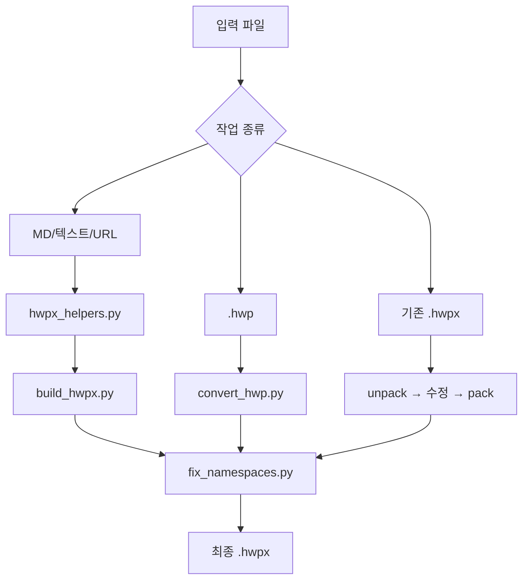
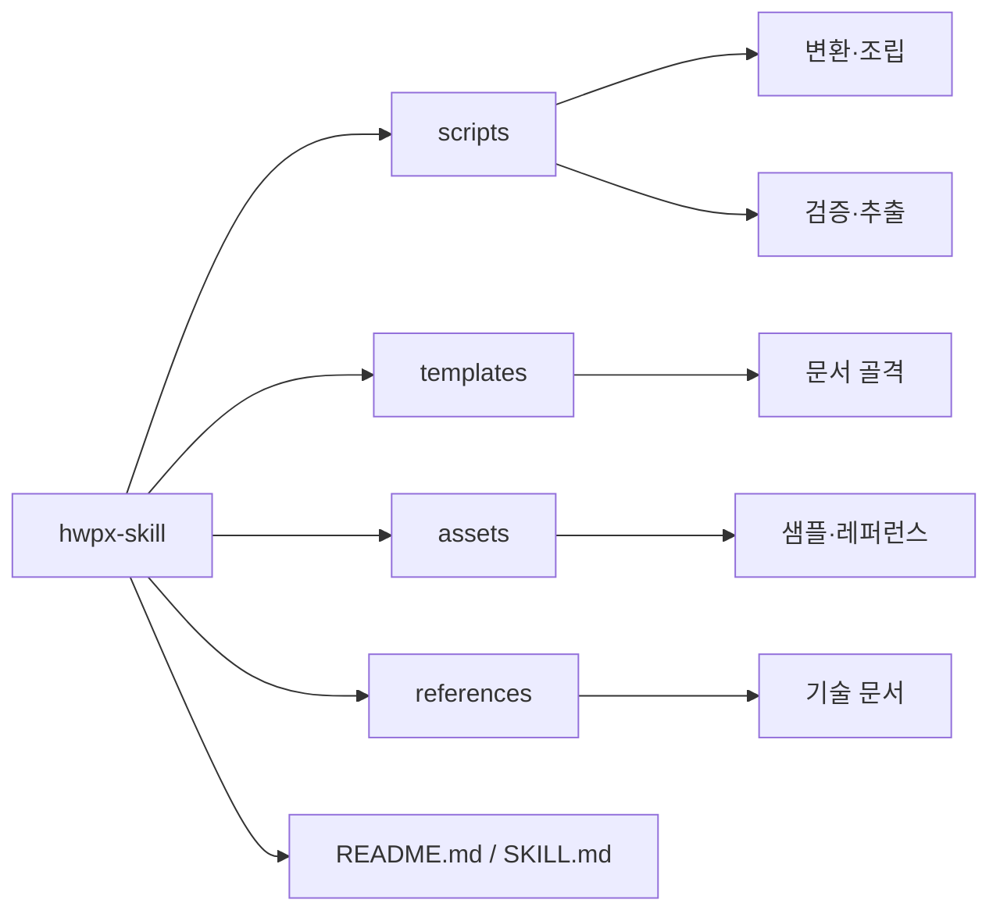

# 프로젝트 소개
- 한 줄 요약: AI 에이전트가 HWP/HWPX 문서를 생성·변환·복제·추출하도록 묶은 작업 스킬 모음
- 저장소 URL: [https://github.com/jkf87/hwpx-skill](https://github.com/jkf87/hwpx-skill)
- `<kbd>Stars</kbd> 69` `<kbd>Forks</kbd> 23` `<kbd>License</kbd> MIT (README 기준, 확인 필요)` `<kbd>Primary Language</kbd> Python`

## 한눈에 보는 핵심 포인트

[jkf87/hwpx-skill](https://github.com/jkf87/hwpx-skill) · <kbd>Stars</kbd> 69 · <kbd>Forks</kbd> 23 · <kbd>License</kbd>  · <kbd>Primary Language</kbd> Python

| 항목 | 값 |
| --- | --- |
| 저장소 | jkf87/hwpx-skill |
| 기본 브랜치 | main |
| 주요 언어 | Python |

| 항목 | 핵심 내용 | 메모 |
|---|---|---|
| 목적 | HWP/HWPX 문서 작업용 Claude 스킬 | 생성, 변환, 읽기, 편집 범위 |
| 주요 입력 | 마크다운, 텍스트, URL, `.hwp`, `.hwpx` | 입력 형태가 다양함 |
| 주요 출력 | `.hwpx`, 추출 텍스트, 복제된 양식 | 문서 생성과 재가공 중심 |
| 핵심 처리 | 템플릿 조립, XML 후처리, unpack/pack | `fix_namespaces.py` 중요 |
| 운영 규칙 | 템플릿 스타일 ID 호환 주의 | 템플릿 혼용 금지, 확인 필요 항목 포함 |

## 무엇을 하는 저장소인가
| 워크플로우 | 의미 | 사용자 관점 |
|---|---|---|
| A | 마크다운/텍스트/URL → HWPX 생성 | 새 문서 초안 제작 |
| B | 템플릿 플레이스홀더 치환 | 양식 채우기 |
| C | 기존 HWPX 편집 | 문서 수정 후 재패키징 |
| D | 레퍼런스 HWPX 기반 새 문서 생성 | 기준 문서 복제 후 새 문서화 |
| E | HWPX 텍스트 읽기/추출 | 내용 검색, 마이그레이션 보조 |
| F | 양식 복제 | 표·이미지·스타일 보존 중심 |
| G | 2025 개정 공문서 작성법 준수 | 관공서 문안 규칙 반영 |
| H | HWP(바이너리) → HWPX 변환 | `.hwp` 입력 처리용 경로 |

- 저장소 성격: 문서 생성 라이브러리보다 작업용 스킬 묶음에 가까움
- 중심 축: `scripts/`의 변환·조립·검증 스크립트
- 보조 자원: `templates/`, `assets/`, `references/`
- 공통 주의점: 빌드 뒤 네임스페이스 후처리 필수

## 빠른 시작
| 상황 | 명령 | 결과 |
|---|---|---|
| 기본 의존성 설치 | `pip install python-hwpx lxml --break-system-packages` | HWPX 작업용 기본 환경 |
| HWP → HWPX 변환 | `python3 scripts/convert_hwp.py input.hwp -o output.hwpx` | `.hwp`를 `.hwpx`로 변환 |
| 양식 분석 | `python3 scripts/clone_form.py --analyze sample.hwpx` | 복제 전 구조 파악 |
| 양식 복제 + 치환 | `python3 scripts/clone_form.py sample.hwpx output.hwpx --map replacements.json` | 템플릿 기반 복제 |
| 네임스페이스 후처리 | `python3 scripts/fix_namespaces.py output.hwpx` | 최종 정리 단계 |
| 텍스트 추출 | `python3 scripts/text_extract.py doc.hwpx --format markdown` | 본문 추출, 마크다운 출력 가능 |

- 추가 의존성: HWP→HWPX 변환 경로는 `pyhwp5`, `olefile` 필요
- 문서 생성 경로: `scripts/hwpx_helpers.py` → `scripts/build_hwpx.py` → `scripts/fix_namespaces.py`
- 초보자 우선 순서: 변환 1개 → 추출 1개 → 복제 1개 순서가 안전

## 폴더 구조
| 경로 | 역할 | 비고 |
|---|---|---|
| `README.md` | 공개 사용법 요약 | 기능 목록과 기본 명령 |
| `SKILL.md` | 스킬 전체 규칙 | Decision Tree, 워크플로우, 규칙 |
| `scripts/` | 실행 스크립트 집합 | 핵심 로직 밀집 |
| `scripts/hwpx_helpers.py` | 조립용 헬퍼 | 배너, 섹션바, 이미지, 빌드 |
| `scripts/convert_hwp.py` | HWP→HWPX 변환 | 워크플로우 H |
| `scripts/build_hwpx.py` | XML/템플릿 조립 | `.hwpx` 생성 단계 |
| `scripts/fix_namespaces.py` | 네임스페이스 후처리 | 필수 후처리 |
| `scripts/clone_form.py` | 양식 복제 | 분석·치환 포함 |
| `scripts/md2hwpx.py` | 마크다운→HWPX 변환 | 생성 흐름 보조 |
| `scripts/analyze_template.py` | 템플릿 분석 | 구조 파악용 |
| `scripts/verify_hwpx.py` | 품질 검증 | 산출물 확인 |
| `scripts/validate.py` | 구조 검증 | 형식 점검 |
| `scripts/text_extract.py` | 텍스트 추출 | plain text, markdown |
| `scripts/create_document.py` | 문서 생성 | 생성 진입점 후보 |
| `scripts/office/` | unpack/pack 유틸 | 편집 흐름 지원 |
| `templates/` | 문서 템플릿 | 재사용 골격 |
| `templates/base/` | 기본 skeleton | 공통 시작점 |
| `templates/report/` | 보고서 템플릿 | 보고서형 문서 |
| `templates/gonmun/` | 공문 템플릿 | 공문 스타일 |
| `templates/minutes/` | 회의록 템플릿 | 회의 문서 |
| `templates/proposal/` | 제안서 템플릿 | 제안 문서 |
| `templates/government/` | 관공서 템플릿 | 컬러 배너/섹션바 |
| `assets/` | 레퍼런스 자산 | 샘플·참조용 |
| `references/` | 기술 문서 | 세부 규칙·설명 |

## 실행 흐름
| 단계 | 입력 | 주요 스크립트 | 출력 |
|---|---|---|---|
| 1 | 마크다운/텍스트/URL | `hwpx_helpers.py` | 중간 XML 조각 |
| 2 | 중간 XML 조각 | `build_hwpx.py` | `.hwpx` 초안 |
| 3 | `.hwpx` 초안 | `fix_namespaces.py` | 정리된 `.hwpx` |
| 4 | `.hwp` 원본 | `convert_hwp.py` | 변환된 `.hwpx` |
| 5 | 기존 `.hwpx` | unpack → 수정 → pack | 편집된 `.hwpx` |
| 6 | 기존 양식 | `clone_form.py` | 복제본 + 치환 결과 |
| 7 | `.hwpx` 본문 | `text_extract.py` | 텍스트/마크다운 |

- 공통 핵심: `fix_namespaces.py`가 마무리 단계
- 검증 보조: `verify_hwpx.py`, `validate.py`
- 템플릿 주의: 스타일 ID는 템플릿 간 호환 불가, 동일 템플릿 계열만 안전
- 파일 포맷 주의: `mimetype`은 첫 ZIP 엔트리, `ZIP_STORED` 규칙

## 기술 스택
| 범주 | 기술 | 역할 |
|---|---|---|
| 언어 | Python | 스크립트 전체 기반 |
| XML 처리 | `lxml` | HWPX 조립·수정 |
| HWPX 기본 라이브러리 | `python-hwpx` | 문서 생성 보조 |
| HWP 변환 | `pyhwp5` | `.hwp` 파싱 경로 |
| 바이너리 처리 | `olefile` | HWP OLE 구조 지원 |
| 문서 포맷 | HWPX | XML/ZIP 기반 문서, 추정 |
| 작업 방식 | unpack/modify/pack | 기존 문서 편집의 기본 패턴 |

## 먼저 읽을 파일
| 우선순위 | 파일 | 읽는 이유 |
|---|---|---|
| 1 | `SKILL.md` | 전체 규칙, 워크플로우, 판단 기준 |
| 2 | `README.md` | 기능 목록, 설치, 빠른 시작 |
| 3 | `scripts/hwpx_helpers.py` | 실제 조립 단위 확인 |
| 4 | `scripts/build_hwpx.py` | 최종 `.hwpx` 생성 방식 |
| 5 | `scripts/fix_namespaces.py` | 필수 후처리 규칙 이해 |
| 6 | `scripts/convert_hwp.py` | `.hwp` 변환 흐름 |
| 7 | `scripts/clone_form.py` | 양식 복제 방식 |
| 8 | `scripts/text_extract.py` | 읽기/추출 출력 형식 |
| 9 | `scripts/validate.py` / `scripts/verify_hwpx.py` | 검증 기준 확인 |
| 10 | `templates/` 하위 폴더 | 실제 문서 골격과 스타일 확인 |

## 용어 사전
| 용어 | 뜻 | 문맥 |
|---|---|---|
| HWP | 한글 바이너리 문서 포맷 | `.hwp` 입력 |
| HWPX | 한글의 XML 기반 문서 포맷 | `.hwpx` 출력 |
| 템플릿 | 반복 문서의 기본 골격 | 보고서, 공문, 제안서 |
| 플레이스홀더 | 바뀌는 자리표시자 | 템플릿 치환 |
| unpack/pack | 내부 구조 분해/재조립 | 기존 HWPX 편집 |
| 네임스페이스 | XML 태그 충돌 방지 식별자 | 후처리 핵심 |
| 양식 복제 | 표·이미지·스타일 유지 복사 | 서식 보존 목적 |
| 레퍼런스 HWPX | 기준으로 삼는 기존 문서 | 새 문서 생성 기반 |
| 공문서 작성법 | 공식 문서 작성 규칙 | 워크플로우 G |
| ZIP_STORED | ZIP 압축하지 않는 저장 방식 | 패키징 규칙 |

## Mermaid 다이어그램

