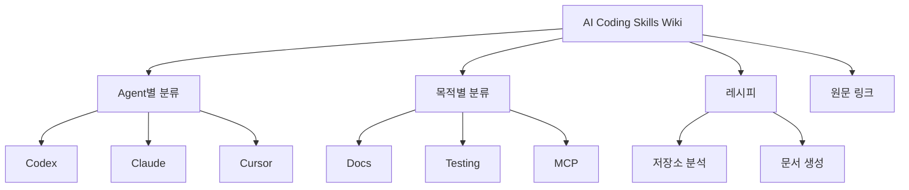

# Skill 생태계 다이어그램

```mermaid
flowchart TD
  A[AI Coding Skills Wiki] --> B[Agent별 분류]
  A --> C[목적별 분류]
  A --> D[레시피]
  A --> E[원문 링크]
  B --> B1[Codex]
  B --> B2[Claude]
  B --> B3[Cursor]
  C --> C1[Docs]
  C --> C2[Testing]
  C --> C3[MCP]
  D --> D1[저장소 분석]
  D --> D2[문서 생성]
```

## 설명

사이트는 `agent`, `purpose`, `recipe`, `reference` 축으로 문서를 연결한다.

