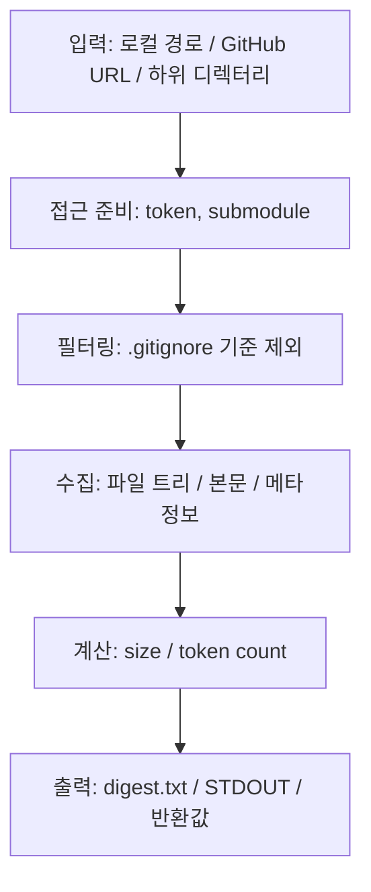

[https://github.com/coderamp-labs/gitingest](https://github.com/coderamp-labs/gitingest) · [홈페이지](https://gitingest.com) · <kbd>Stars</kbd> 14285 · <kbd>Forks</kbd> 1045 · <kbd>License</kbd> MIT · <kbd>Primary Language</kbd> Python

# 프로젝트 소개
Git 저장소·디렉터리 → LLM 친화적 텍스트 digest.

## 한눈에 보는 핵심 포인트
| 항목 | 요약 |
|---|---|
| 한 줄 정의 | 저장소 구조, 본문, 통계를 묶은 prompt-friendly digest 생성 |
| 입력 | 로컬 경로, GitHub URL, 특정 하위 디렉터리 |
| 출력 | `summary`, `tree`, `content`, 파일 크기, token count |
| 사용 방식 | CLI, Python 패키지, Docker self-host |
| 기본 규칙 | `.gitignore` 기본 제외, `digest.txt` 기본 저장 |
| 확장 포인트 | private repo 토큰, submodule 포함, STDOUT 출력 |

## 무엇을 하는 저장소인가
| 관점 | 내용 |
|---|---|
| 목적 | 코드베이스 요약용 텍스트 추출 |
| 사용자 | LLM 프롬프트 작성, 코드 리뷰, 저장소 온보딩 |
| 핵심 가치 | 구조 + 본문 + 통계의 동시 제공 |
| 접근 방식 | `hub` → `ingest` URL 패턴, CLI/API/Web 경로 병행 |
| 외부 연결 | 브라우저 확장, 웹 서비스, self-host 옵션 |

- 저장소 전체를 “읽기 좋은 텍스트 묶음”으로 압축
- 단순 덤프보다 구조 정보 유지에 초점
- LLM 입력 길이 관리, 컨텍스트 확인, 코드 파악에 적합
- private repo, submodule, 원격 URL 처리까지 포함
- 웹 화면과 로컬 도구가 같은 목적을 공유 `추정`

## 빠른 시작
| 상황 | 예시 명령 | 메모 |
|---|---|---|
| 설치 | `pip install gitingest` | 기본 CLI/패키지 |
| CLI 권장 | `pipx install gitingest` | 격리 설치 |
| 서버 포함 | `pip install "gitingest[server]"` | self-host 용도 |
| 로컬 분석 | `gitingest /path/to/directory` | 기본 `digest.txt` |
| GitHub URL | `gitingest https://github.com/coderamp-labs/gitingest` | 원격 저장소 |
| Python API | `from gitingest import ingest` | 반환값: `summary, tree, content` |
| private repo | `--token` 또는 `GITHUB_TOKEN` | PAT 필요 |
| stdout 출력 | `gitingest ... --output -` | 파이프 연동 |

- 전체 옵션 확인: `gitingest --help`
- Docker self-host: `docker build -t gitingest .` → `docker run -d --name gitingest -p 8000:8000 gitingest`
- Docker 빌드 단계의 `.[server,mcp]` 설치 중 `mcp` 정의 위치 `확인 필요`

## 폴더 구조
| 경로 | 역할 | 메모 |
|---|---|---|
| `src/` | 핵심 구현 | CLI·패키지·서버 진입점 포함 `추정` |
| `tests/` | 테스트 코드 | `pytest` 기반 |
| `docs/` | 문서 자산 | 프론트페이지 이미지 포함 |
| `.github/` | 자동화 설정 | CI, 릴리스, 워크플로우 `추정` |
| `.docker/` | Docker 보조 파일 | 빌드/배포 보조 `추정` |
| `.vscode/` | 편집기 설정 | 개발 편의용 |
| `compose.yml` | 컨테이너 조합 | 개발·운영·스토리지 구성 |
| `Dockerfile` | 이미지 빌드 | 서버 실행 진입점 |
| `pyproject.toml` | 패키지 설정 | 의존성, 스크립트, 테스트, 린트 |
| `requirements*.txt` | 의존성 목록 | 배포/개발 분리 `추정` |

## 실행 흐름
| 단계 | 입력 | 핵심 처리 | 결과 |
|---|---|---|---|
| 1. 진입 | CLI 인자 / `ingest()` 호출 / HTTP 요청 | 대상 해석 | 분석 범위 확정 |
| 2. 접근 | GitHub URL, token, submodule 옵션 | 인증·복제 준비 | 원격 소스 확보 |
| 3. 필터 | `.gitignore`, `--include-gitignored` | 제외/포함 규칙 적용 | 파일 목록 정리 |
| 4. 집계 | 파일 트리, 본문, 메타정보 | 크기·token count 계산 | `summary`, `tree`, `content` |
| 5. 출력 | `--output`, STDOUT, 반환값 | digest 저장/전달 | `digest.txt` 또는 파이프 |
| 6. 배포 | Docker, `python -m server` | 웹/API 제공 | self-host endpoint |

- 핵심 경로: 입력 수집 → 필터링 → 컨텍스트 압축 → 출력
- `.gitignore` 기반 제외가 기본값
- token count와 파일 구조가 함께 남는 점이 특징
- 서버 모드에서는 동일한 ingest 결과를 HTTP 계층으로 노출 `추정`

## 기술 스택
| 범주 | 구성 | 용도 |
|---|---|---|
| 언어/런타임 | Python 3.8+ | 기본 실행 환경 |
| CLI | `click` | 명령행 인터페이스 |
| 저장소/네트워크 | `gitpython`, `httpx` | 로컬 Git, 원격 URL 처리 |
| 필터링 | `pathspec` | `.gitignore` 해석 |
| 설정/모델 | `pydantic`, `python-dotenv` | 구성 관리 |
| 로깅 | `loguru` | 로그 출력 |
| 토큰화 | `tiktoken` | token count 계산 |
| 서버 | `starlette`, `fastapi[standard]`, `uvicorn`, `slowapi` | self-host API/웹 |
| 관찰성 | `prometheus-client`, `sentry-sdk[fastapi]` | metrics / error tracking |
| 스토리지 | `boto3` | S3 연동 |
| 테스트 | `pytest`, `pytest-asyncio`, `pytest-mock` | 검증 |
| 품질 | `ruff`, `pre-commit` | lint / hook |

## 먼저 읽을 파일
| 순서 | 파일 | 보는 이유 |
|---|---|---|
| 1 | `README.md` | 사용자 시나리오, CLI/API/Docker 사용법 |
| 2 | `pyproject.toml` | 패키지 정보, extras, entry point, 테스트 설정 |
| 3 | `src/` | 실제 ingest 로직, 출력 포맷, 서버 코드 |
| 4 | `tests/` | 기대 동작, 예외, async 흐름 |
| 5 | `Dockerfile` | self-host 실행 경로, 이미지 구성 |
| 6 | `compose.yml` | 개발/운영 서비스 조합 |
| 7 | `requirements.txt` / `requirements-dev.txt` | 배포·개발 의존성 차이 |

## 용어 사전
| 용어 | 뜻 |
|---|---|
| `digest` | 저장소 내용을 LLM 입력용 텍스트로 압축한 결과 |
| `ingest` | 코드베이스를 읽어 digest로 바꾸는 핵심 동작 |
| `tree` | 폴더·파일 구조 요약 |
| `content` | 선택된 파일의 본문 묶음 |
| `summary` | 규모, 파일 수, token count 같은 상위 통계 |
| `PAT` | GitHub Personal Access Token, private repo 접근용 |
| `submodule` | Git 저장소 안에 포함된 다른 Git 저장소 |
| `.gitignore` | 기본 제외 규칙 파일 |
| `token count` | LLM 프롬프트 분량 추정치 |
| `STDOUT` | 파일 대신 터미널로 내보내는 출력 경로 |

## Mermaid 다이어그램
입력에서 digest 생성까지의 흐름.



사용 경로와 배포 경로의 관계.

```mermaid
flowchart LR
    subgraph Entry[입력 방식]
        A[CLI: gitingest ...]
        B[Python: ingest()]
        C[Web: gitingest.com]
        D[Docker / compose]
    end

    subgraph Core[공통 핵심]
        E[ingest pipeline]
        F[summary / tree / content]
        G[stats]
    end

    A --> E
    B --> E
    C --> E
    D --> C
    E --> F --> G
```