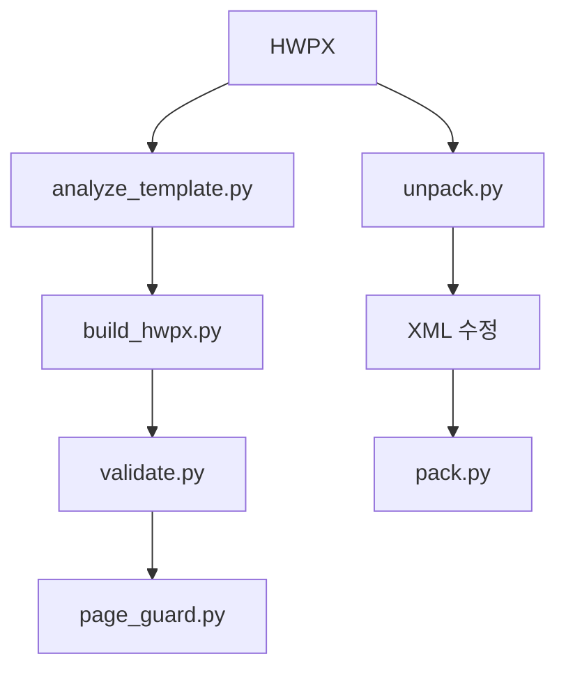
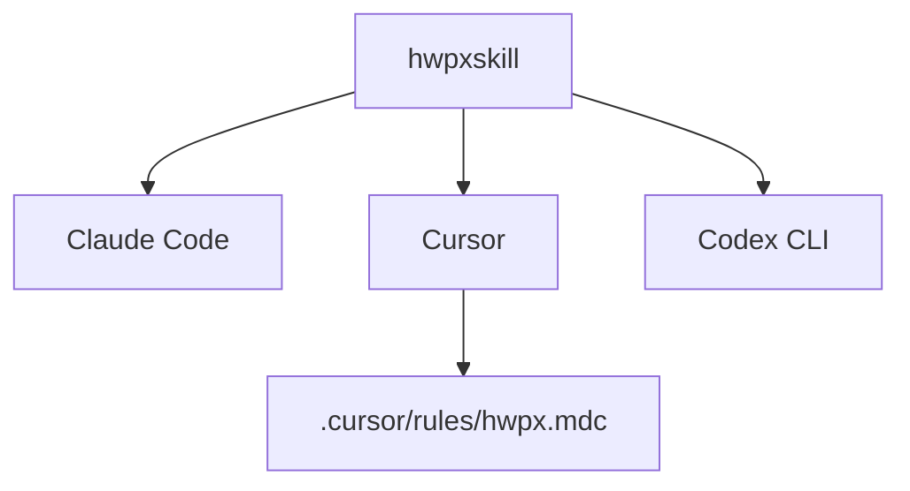

# 프로젝트 소개
저장소: [Canine89/hwpxskill](https://github.com/Canine89/hwpxskill) · <kbd>Stars</kbd> 170 · <kbd>Forks</kbd> 58 · <kbd>License</kbd> 확인 필요 · <kbd>Primary Language</kbd> Python

한 줄 요약: HWPX XML을 직접 다뤄, 기존 서식을 최대한 보존한 채 내용 교체와 새 문서 생성을 지원하는 AI 코딩 에이전트용 스킬 저장소.

## 한눈에 보는 핵심 포인트

[Canine89/hwpxskill](https://github.com/Canine89/hwpxskill) · <kbd>Stars</kbd> 170 · <kbd>Forks</kbd> 58 · <kbd>License</kbd>  · <kbd>Primary Language</kbd> Python

| 항목 | 값 |
| --- | --- |
| 저장소 | Canine89/hwpxskill |
| 기본 브랜치 | main |
| 주요 언어 | Python |

| 포인트 | 의미 |
|---|---|
| XML 직접 편집 | `python-hwpx` 대신 OWPML XML을 직접 조작 |
| 구조 보존 우선 | 스타일, 표 구조, 셀 병합, 여백 유지 지향 |
| 두 가지 진입점 | 원본 HWPX 편집 / 내장 템플릿 기반 새 문서 생성 |
| 후처리 포함 | 텍스트 추출, 구조 검증, 페이지 수 변화 탐지 |
| 에이전트 호환 | Claude Code, Cursor, Codex CLI에서 사용 가능 |

## 무엇을 하는 저장소인가
| 기능 | 내용 |
|---|---|
| 레퍼런스 분석 | 원본 HWPX에서 스타일과 구조 파악 |
| 내용 교체 | 기존 레이아웃을 유지한 채 본문만 교체 |
| 새 문서 생성 | 공문, 보고서 등 내장 템플릿으로 시작 |
| 텍스트 추출 | 일반 텍스트 또는 Markdown 형태 추출 |
| 검증 | ZIP 구조, XML 유효성, `mimetype` 위치 점검 |
| 페이지 가드 | 원본 대비 페이지 수 변화 감시 |

| 템플릿 | 용도 |
|---|---|
| `base` | 기본 골격 |
| `gonmun` | 공문서 |
| `report` | 보고서 |
| `minutes` | 회의록 |
| `proposal` | 제안서 |

핵심 방향:
- `python-hwpx` 회피, XML 직접 조작 중심
- `charPr`, `paraPr` 단위의 서식 제어
- 원본이 없을 때도 템플릿으로 새 문서 생성
- 문서 완성 후 `page_guard.py`로 구조 흔들림 확인

## 빠른 시작
| 단계 | 내용 | 예시 |
|---|---|---|
| 1 | 저장소 복제 | `git clone https://github.com/Canine89/hwpxskill.git` |
| 2 | 스킬 배치 | Claude Code / Cursor / Codex CLI용 디렉토리에 복사 |
| 3 | 의존성 준비 | Python 3.6+, `lxml`, 가상환경 권장 |
| 4 | 새 문서 생성 | `python3 scripts/build_hwpx.py --template gonmun --output result.hwpx` |
| 5 | 기존 문서 편집 | `unpack.py` → XML 수정 → `pack.py` |
| 6 | 검증 | `validate.py`, `page_guard.py` |

| 도구 | 설치 위치 | 메모 |
|---|---|---|
| Claude Code | `.claude/skills/hwpxskill` 또는 `~/.claude/skills/hwpxskill` | HWPX 작업 시 자동 로드 |
| Cursor | `.cursor/skills/hwpxskill` 또는 `~/.cursor/skills/hwpxskill` | `*.hwpx`용 rule 파일 권장 |
| Codex CLI | `.agents/skills/hwpxskill` 또는 `~/.agents/skills/hwpxskill` | 세션 내 설치 가능 |

주요 명령 묶음:
- 새 문서 생성: `python3 scripts/build_hwpx.py --template gonmun --output result.hwpx`
- 기존 문서 분해: `python3 scripts/office/unpack.py document.hwpx ./unpacked/`
- 기존 문서 재조립: `python3 scripts/office/pack.py ./unpacked/ edited.hwpx`
- 텍스트 추출: `python3 scripts/text_extract.py document.hwpx --format markdown`
- 구조 검증: `python3 scripts/validate.py result.hwpx`
- 페이지 변화 점검: `python3 scripts/page_guard.py --reference reference.hwpx --output result.hwpx`

## 폴더 구조
| 경로 | 역할 | 메모 |
|---|---|---|
| `README.md` | 진입 설명서 | 빠른 시작, 사용 예시 중심 |
| `SKILL.md` | 상세 규칙 | XML 구조, 스타일 ID, 템플릿 매핑 |
| `scripts/` | 실행 도구 | 생성, 분해, 검증, 추출 |
| `templates/` | 템플릿 데이터 | 새 문서용 뼈대 정의 |
| `references/` | 부가 자료 | 내용 세부 확인 필요 |

## 실행 흐름
| 흐름 | 순서 | 결과 |
|---|---|---|
| 새 문서 생성 | 템플릿 선택 → `build_hwpx.py` | 새 `.hwpx` 산출 |
| 기존 문서 편집 | `analyze_template.py` → `unpack.py` → XML 수정 → `pack.py` | 구조 보존 편집본 |
| 검증 | `validate.py` → `page_guard.py` | 구조와 페이지 수 확인 |
| 텍스트 추출 | `text_extract.py --format markdown` | Markdown 또는 텍스트 |

작업 순서 감각:
- 원본 첨부 또는 템플릿 선택
- XML 구조 확인
- 내용 교체
- 검증
- 페이지 수 변화 확인

## 기술 스택
| 분류 | 내용 |
|---|---|
| 언어 | Python |
| 문서 표준 | HWPX / OWPML XML |
| XML 처리 | `lxml` |
| 패키징 | ZIP 기반 HWPX 구조 |
| 자동화 대상 | Claude Code, Cursor, Codex CLI |
| 보조 도구 | `validate.py`, `page_guard.py`, `text_extract.py` |

보충 메모:
- `python-hwpx` API보다 직접 XML 편집 쪽 선택
- 문서 구조 파악과 후처리 스크립트가 함께 묶인 형태

## 먼저 읽을 파일
| 파일 | 이유 |
|---|---|
| `README.md` | 전체 목적과 기본 사용법 |
| `SKILL.md` | XML 규칙, 스타일 ID, 템플릿 매핑 |
| `scripts/analyze_template.py` | 레퍼런스 분석 흐름 |
| `scripts/build_hwpx.py` | 생성 로직의 중심 |
| `scripts/office/unpack.py` | HWPX 분해 방식 |
| `scripts/office/pack.py` | 재조립 방식 |
| `scripts/validate.py` | 구조 검증 기준 |
| `scripts/page_guard.py` | 페이지 수 변화 체크 |
| `scripts/text_extract.py` | 텍스트 추출 결과 형식 |

## 용어 사전
| 용어 | 의미 |
|---|---|
| HWPX | 한컴오피스 문서 포맷 |
| OWPML | HWPX 내부 XML 표준 |
| `charPr` | 글자 서식 단위 |
| `paraPr` | 문단 서식 단위 |
| unpack / pack | HWPX ↔ 디렉토리 변환 |
| page_guard | 원본 대비 페이지 수 차이 탐지 |
| 템플릿 | 공문, 보고서 같은 기본 문서 뼈대 |
| 스킬 | AI 코딩 에이전트에 넣어 쓰는 작업 패키지 |

## Mermaid 다이어그램
문서 생성/편집 흐름

스킬 배치 흐름
