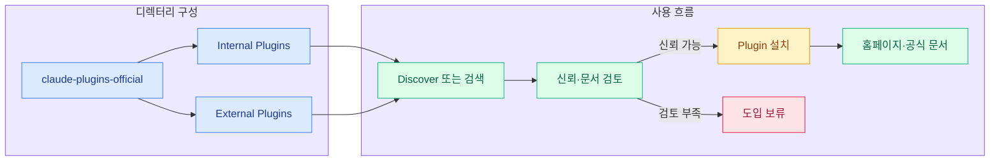
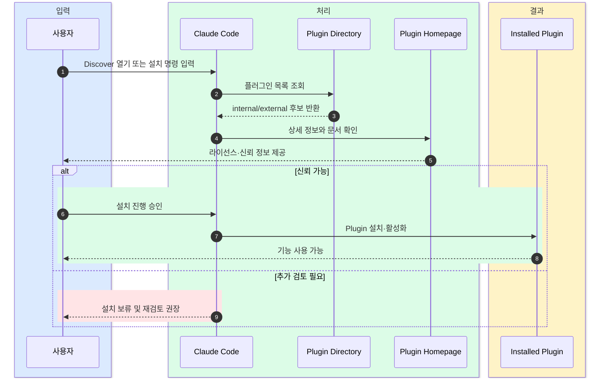

# Claude Code 플러그인 디렉터리

  Claude Code
  Plugin Marketplace
  Internal Plugins
  External Plugins
  MCP

## 한 문장 정의

  
One-Line Definition

  
이 문서는 Claude Code에서 설치할 수 있는 공식·서드파티 플러그인을 한곳에 모아 소개하는 GitHub 기반 디렉터리다.

## 원문 정보

  

    
원문 제목

    
Claude Code Plugins Directory

  

  

    
카테고리

    
github

  

  

    
원문 링크

    
<a href="https://github.com/anthropics/claude-plugins-official">https://github.com/anthropics/claude-plugins-official</a>

  

## 3줄 요약

  
빠르게 읽는 요약

- Claude Code Plugins Directory는 Claude Code용 플러그인을 모아둔 큐레이션 마켓플레이스 성격의 저장소다.
- 플러그인은 Anthropic이 관리하는 internal 플러그인과 파트너·커뮤니티가 제공하는 external 플러그인으로 나뉜다.
- 설치는 간단하지만, 실제 포함된 MCP 서버나 외부 소프트웨어는 개별 플러그인마다 다르므로 신뢰 검토가 핵심이다.

## 한눈에 보는 구조

  
Structure View

### 플러그인 디렉터리 구조와 도입 흐름

  
Interaction Flow

### 플러그인 탐색부터 설치 판단까지

## 핵심 포인트

1. 저장소의 핵심 역할은 Claude Code 플러그인을 탐색·발견·설치하는 공식 진입점을 제공하는 데 있다.
2. 구조가 `plugins`와 `external plugins`로 나뉘어 있어, 공식 관리 항목과 외부 생태계를 구분해 이해하기 쉽다.
3. 설치는 `/plugin install {plugin-name}@claude-plugins-official` 명령 또는 `/plugin > Discover` 흐름으로 진행된다.
4. internal 플러그인 개발자는 예제 구현을 참고할 수 있고, external 플러그인 제공자는 제출 절차와 승인 기준을 따라야 한다.
5. Anthropic이 모든 플러그인의 내부 동작이나 변경 가능성을 보증하지 않으므로, 실제 도입 전 홈페이지·라이선스·문서를 직접 확인해야 한다.

## 읽는 순서

<ol class="poket-reading-list">
  <li class="poket-reading-item">1디렉터리 목적 파악</li>
  <li class="poket-reading-item">2internal/external 구조 확인</li>
  <li class="poket-reading-item">3설치 방법 익히기</li>
  <li class="poket-reading-item">4신뢰·보안 주의 읽기</li>
  <li class="poket-reading-item">5문서와 예제 구현 보기</li>
</ol>

## 활용 시나리오

  

팀이 Claude Code 환경에 새 기능을 붙일 때, 검증된 플러그인 후보를 빠르게 탐색하는 출발점으로 쓸 수 있다.

  

사내에서 Claude Code 플러그인 도입 가이드를 만들 때, 공식 플러그인과 외부 플러그인을 구분해 정책을 세우는 기준 자료가 된다.

  

플러그인 개발자가 제출 전 기대 구조와 예제 구현 방향을 파악하는 참고 디렉터리로 활용할 수 있다.

## 주요 개념

### Claude Code

Anthropic의 개발자용 코딩 에이전트 환경으로, 명령과 확장 기능을 통해 작업 흐름을 넓힐 수 있다.

### Plugin

Claude Code에 특정 기능이나 외부 연결 능력을 추가하는 확장 단위다.

### Internal Plugins

Anthropic 팀이 직접 개발·유지보수하는 플러그인 묶음이다.

### External Plugins

파트너사나 커뮤니티가 제공하며, 승인 기준을 통과해 디렉터리에 포함되는 외부 플러그인이다.

### MCP server

플러그인이 외부 도구나 데이터와 연결될 때 사용할 수 있는 서버 구성 요소로, 실제 동작과 권한 범위를 별도로 확인해야 한다.

### Discover

Claude Code 내부에서 플러그인을 찾아보고 설치 후보를 탐색하는 UI 진입점이다.

## 실무 관점

이 디렉터리는 단순한 목록이 아니라 Claude Code 확장을 평가하고 도입하기 위한 공식 출발점이며, 실제 업무에서는 설치 편의성보다 플러그인 신뢰성 검토 절차를 함께 갖추는 것이 더 중요하다.

## 추천 대상

Claude Code 확장 기능을 도입하려는 개발자, 사내 개발도구 운영자, 플러그인 제출을 준비하는 파트너·커뮤니티 제작자에게 적합하다.

## 주의사항

- 플러그인 설치 전 제공 주체와 홈페이지 문서를 먼저 확인해야 한다.
- external 플러그인은 품질 기준을 통과했더라도 내부 동작 전체를 자동으로 보증한다고 보면 안 된다.
- MCP 서버나 포함 소프트웨어의 권한 범위와 변경 가능성을 별도로 검토해야 한다.
- 라이선스는 저장소 공통이 아니라 각 플러그인별로 다를 수 있으므로 개별 확인이 필요하다.

## 참고

- 이 문서는 원문을 바탕으로 재구성한 한국어 해설 문서입니다.
- 정확한 표현과 전체 맥락은 원문을 직접 확인하세요.
