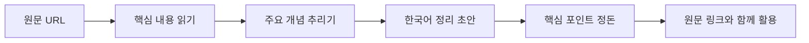
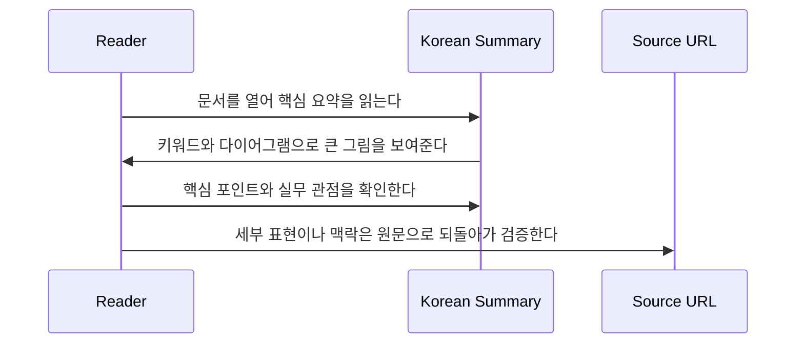

# Example Domain 한국어 해설

  GitHub
  한국어 해설
  요약 정리
  원문 링크
  실무 관점

## 한 문장 정의

  
One-Line Definition

  
영문 기술 자료의 큰 그림과 실무 포인트를 빠르게 파악할 수 있도록 재구성한 한국어 안내서다.

## 원문 정보

  

    
원문 제목

    
Example Domain

  

  

    
카테고리

    
docs

  

  

    
원문 링크

    
<a href="https://example.com">https://example.com</a>

  

## 3줄 요약

  
빠르게 읽는 요약

- 이 자료는 `Example Domain` 주제를 다루는 영문 기술 문서다.
- 핵심 내용을 빠르게 이해할 수 있도록 한국어 해설 중심으로 재구성했다.
- 원문 전체 복제 대신 주요 개념, 포인트, 실무 관점을 중심으로 정리한다.

## 한눈에 보는 구조

  
Structure View

### 핵심 흐름

  
Interaction Flow

### 읽는 사람 기준 작동 순서

## 핵심 포인트

1. 문서 주제: Example Domain
2. 카테고리: docs
3. 원문 발췌: Example Domain Example Domain This domain is for use in documentation examples without needing permission. Avoid use in operations. Learn more
4. 주요 태그: demo, sample

## 읽는 순서

<ol class="poket-reading-list">
  <li class="poket-reading-item">1먼저 3줄 요약으로 문서의 목표와 범위를 잡는다.</li>
  <li class="poket-reading-item">2그다음 핵심 포인트와 다이어그램을 보며 구조를 이해한다.</li>
  <li class="poket-reading-item">3마지막으로 실무 관점과 주의사항을 확인해 실제 적용 여부를 판단한다.</li>
</ol>

## 활용 시나리오

  

처음 보는 저장소나 기술 문서를 빠르게 훑는 온보딩 메모로 활용할 수 있다.

  

팀 내부 공유용 한국어 요약 초안을 만드는 데 바로 쓸 수 있다.

## 주요 개념

### Source URL

원문 위치를 나타내며, 상세 내용은 반드시 원문과 함께 확인해야 한다.

### Practical Take

이 자료를 실제 업무나 학습에 어떻게 활용할지 정리한 관점이다.

## 실무 관점

먼저 이 문서를 빠르게 읽고, 세부 구현이나 정확한 표현은 원문 링크로 되돌아가 확인하는 방식이 적합하다.

## 추천 대상

영문 기술 자료를 빠르게 파악하고 한국어 메모로 축적하고 싶은 개발자에게 적합하다.

## 주의사항

- 이 결과는 해설 중심 요약이므로 세부 표현은 원문과 차이가 있을 수 있다.
- 정확한 API 문구나 정책성 내용은 원문을 직접 확인해야 한다.

## 참고

- 이 문서는 원문을 바탕으로 재구성한 한국어 해설 문서입니다.
- 정확한 표현과 전체 맥락은 원문을 직접 확인하세요.
