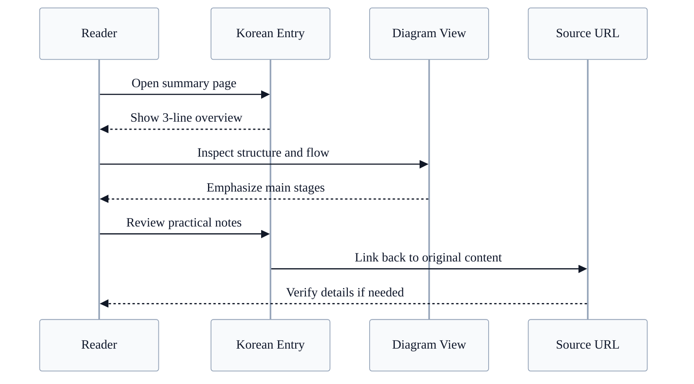

# Example Domain 한국어 해설

  GitHub
  Korean Summary
  Workflow
  Mermaid
  Practical Guide

## 한 문장 정의

  
One-Line Definition

  
영문 기술 자료의 구조와 실무 포인트를 한국어로 빠르게 파악하도록 재구성한 요약 문서다.

## 원문 정보

  

    
원문 제목

    
Example Domain

  

  

    
카테고리

    
docs

  

  

    
원문 링크

    
<a href="https://example.com">https://example.com</a>

  

## 3줄 요약

  
빠르게 읽는 요약

- `Example Domain`의 핵심 주제를 빠르게 이해할 수 있도록 큰 그림 중심으로 정리한 문서다.
- 원문 전체를 복제하지 않고, 개념 구조와 활용 맥락을 한국어 설명으로 압축한다.
- 요약, 흐름도, 실무 포인트를 함께 제공해 처음 보는 자료도 진입 장벽을 낮춘다.

## 한눈에 보는 구조

  
Structure View

### 핵심 흐름 구조

```mermaid
%%{init: {'theme':'base','themeVariables': {'primaryColor':'#d9f5ef','primaryTextColor':'#0f172a','primaryBorderColor':'#0f766e','lineColor':'#0f172a','secondaryColor':'#fef3c7','tertiaryColor':'#ede9fe','fontFamily':'Inter, sans-serif'}}}%%
flowchart LR
    subgraph S1["Source"]
        A["English Source"] --> B["Fetch & Extract"]
    end
    subgraph S2["Interpret"]
        C["Concept Selection"] --> D["Korean Summary"]
        D --> E["Diagram & Highlights"]
    end
    subgraph S3["Publish"]
        F["Rendered Entry"] --> G["GitHub Pages"]
    end
    B --> C
    E --> F
    classDef source fill:#cffafe,stroke:#0891b2,color:#0f172a,stroke-width:2px;
    classDef explain fill:#dcfce7,stroke:#16a34a,color:#0f172a,stroke-width:2px;
    classDef publish fill:#fef3c7,stroke:#d97706,color:#0f172a,stroke-width:2px;
    class A,B source;
    class C,D,E explain;
    class F,G publish;
```

  
Interaction Flow

### 문서 소비 흐름

## 핵심 포인트

1. 문서 주제: Example Domain
2. 카테고리: docs
3. 원문 발췌: Example Domain Example Domain This domain is for use in documentation examples without needing permission. Avoid use in operations. Learn more
4. 관련 태그: demo, sample

## 읽는 순서

<ol class="poket-reading-list">
  <li class="poket-reading-item">1먼저 3줄 요약으로 이 문서가 무엇을 설명하는지 잡는다.</li>
  <li class="poket-reading-item">2구조도와 상호작용 흐름을 보며 큰 그림을 이해한다.</li>
  <li class="poket-reading-item">3핵심 포인트와 용어를 읽고 실무 활용 가능성을 판단한다.</li>
</ol>

## 활용 시나리오

  

처음 보는 저장소나 기술 문서를 빠르게 훑고 공유용 메모를 만들 때 유용하다.

  

팀 내부에서 원문 링크와 함께 읽기 쉬운 입문 문서를 남길 때 적합하다.

## 주요 개념

### Source URL

원문 세부 정보와 정확한 표현은 항상 원문 링크에서 다시 검증해야 한다.

### Practical Take

이 자료를 실제 업무나 학습 흐름에 어떻게 연결할지 짧게 정리한 부분이다.

## 실무 관점

이 문서는 긴 원문을 바로 읽기 전에 큰 그림을 빠르게 잡고, 필요한 경우 원문으로 다시 내려가는 중간 계층으로 쓰기 좋다.

## 추천 대상

영문 기술 자료를 빠르게 파악하고 팀 공유용 요약이나 학습 노트를 만들고 싶은 개발자에게 적합하다.

## 주의사항

- 요약 문서는 설명 중심이므로 정확한 표현과 세부 조건은 원문 링크에서 다시 확인해야 한다.
- 다이어그램은 이해를 돕기 위한 상위 구조이며, 실제 구현 세부 흐름과 1:1 대응하지 않을 수 있다.

## 참고

- 이 문서는 원문을 바탕으로 재구성한 한국어 해설 문서입니다.
- 정확한 표현과 전체 맥락은 원문을 직접 확인하세요.
