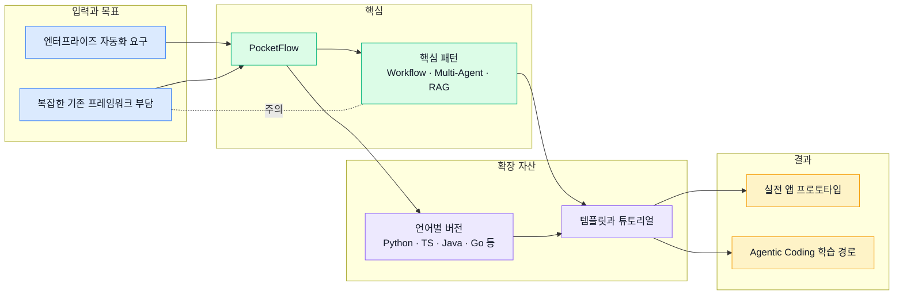
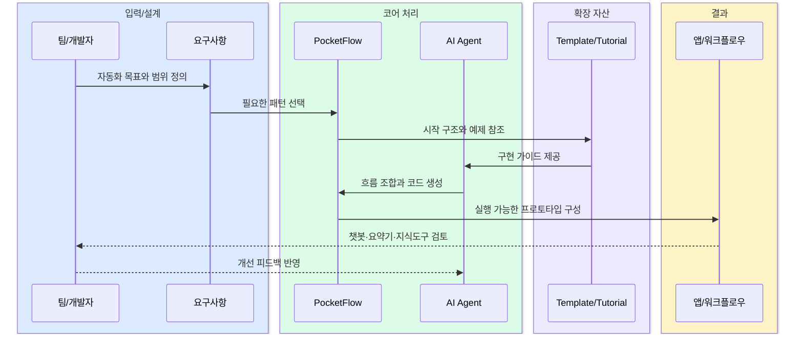

# The Pocket: Pocket Flow 중심의 경량 AI 에이전트 개발 아카이브

  PocketFlow
  Agentic Coding
  Multi-Agent
  RAG
  Workflow Template

## 한 문장 정의

  
One-Line Definition

  
The Pocket은 Pocket Flow를 중심으로 에이전트형 AI를 작게 설계하고 빠르게 실험할 수 있게 돕는 GitHub 조직이다.

## 원문 정보

  

    
원문 제목

    
The Pocket

  

  

    
카테고리

    
github

  

  

    
원문 링크

    
<a href="https://github.com/The-Pocket">https://github.com/The-Pocket</a>

  

## 3줄 요약

  
빠르게 읽는 요약

- The Pocket은 복잡한 대형 프레임워크 대신, 매우 작은 구조로 AI 시스템의 핵심 패턴을 조합하려는 방향을 제시한다.
- 핵심 저장소인 PocketFlow는 다중 에이전트, 워크플로우, RAG 같은 패턴을 간결하게 다루도록 설계되었고, 여러 언어 버전과 템플릿으로 확장되고 있다.
- 튜토리얼 저장소들은 챗봇, 코드베이스 이해, 영상 요약 같은 실제 사례를 통해 Agentic Coding 방식이 어떻게 적용되는지 보여준다.

## 한눈에 보는 구조

  
Structure View

### The Pocket 생태계의 구성과 활용 흐름

  
Interaction Flow

### Pocket Flow 기반 프로젝트를 만드는 상위 상호작용

## 핵심 포인트

1. 중심 메시지는 사람이 구조를 설계하고 AI Agent가 구현을 맡는 Agentic Coding이다.
2. PocketFlow는 약 100줄 수준의 미니멀 프레임워크라는 점을 전면에 내세워 학습 비용과 에이전트의 부담을 낮춘다.
3. 지원 패턴은 batched workflow, multi-agent orchestration, retrieval-augmented generation처럼 실무에서 자주 쓰이는 흐름에 집중된다.
4. Python이 출발점이지만 Typescript, Java, C++, Go, Zig, PHP, Rust 템플릿 등으로 생태계가 넓어지고 있다.
5. 조직 차원에서 템플릿과 튜토리얼을 함께 제공해, 프레임워크 설명에 그치지 않고 재현 가능한 예제로 연결한다.
6. 대표 예제는 Website Chatbot, Codebase Knowledge Builder, Youtube Summarizer, AI Paul Graham처럼 목적이 분명한 앱 단위로 제시된다.

## 읽는 순서

<ol class="poket-reading-list">
  <li class="poket-reading-item">1조직 개요와 PocketFlow 위치 파악</li>
  <li class="poket-reading-item">2PocketFlow 핵심 개념 훑기</li>
  <li class="poket-reading-item">3언어별 템플릿 비교</li>
  <li class="poket-reading-item">4튜토리얼 예제 하나 선택해 따라가기</li>
</ol>

## 활용 시나리오

  

사내 AI PoC를 시작할 때, 무거운 프레임워크 대신 작은 구조로 에이전트 흐름을 빠르게 검증하는 데 유용하다.

  

웹사이트 문서나 지식베이스를 바탕으로 고객지원형 챗봇을 만드는 초기 프로토타입에 적합하다.

  

기존 코드베이스를 설명 가능한 형태로 변환하거나 개발자 온보딩 자료를 만드는 실험에 활용할 수 있다.

  

영상, 문서, 검색 결과를 요약하는 업무 자동화를 작은 워크플로우 단위로 분해해 구현할 때 도움이 된다.

## 주요 개념

### Agentic Coding

사람이 전체 구조와 의도를 설계하고, AI Agent가 실제 코드 작성과 연결 작업을 수행하는 개발 방식이다.

### PocketFlow

에이전트와 LLM 기반 작업 흐름을 매우 작은 추상화로 구성하려는 경량 프레임워크다.

### RAG

모델이 외부 문서나 검색 결과를 함께 참고해 더 정확한 답변을 생성하도록 만드는 패턴이다.

### Multi-Agent Orchestration

역할이 다른 여러 Agent를 순서와 규칙에 따라 협력시키는 운영 방식이다.

### Template Repository

새 프로젝트를 빠르게 시작할 수 있도록 기본 구조와 예제 구성을 미리 담아둔 저장소다.

### Workflow

입력 처리, 검색, 요약, 검증 같은 단계를 순차 또는 분기 구조로 연결한 실행 흐름이다.

## 실무 관점

이 조직의 가치는 거대한 AI 플랫폼을 도입하기 전에, PocketFlow와 튜토리얼 조합으로 작은 성공 사례를 빠르게 만들 수 있다는 점에 있다.

## 추천 대상

에이전트형 AI를 처음 설계하는 개발자, 사내 자동화 PoC를 짧은 주기로 검증하려는 팀, 그리고 예제 중심으로 워크플로우 패턴을 익히고 싶은 실무자에게 적합하다.

## 주의사항

- 미니멀한 구조가 장점이지만, 대규모 운영 기능이나 복잡한 거버넌스 요구까지 자동으로 해결해주지는 않는다.
- 튜토리얼이 곧바로 운영 환경 품질을 보장하는 것은 아니므로 로깅, 보안, 평가 체계는 별도로 보강해야 한다.
- 여러 언어 버전이 존재해도 문서 성숙도와 유지보수 속도는 저장소마다 차이가 있을 수 있다.
- 예제가 쉬워 보여도 실제 업무 데이터와 연결하면 프롬프트 설계, 검색 품질, 실패 처리 전략이 중요해진다.

## 참고

- 이 문서는 원문을 바탕으로 재구성한 한국어 해설 문서입니다.
- 정확한 표현과 전체 맥락은 원문을 직접 확인하세요.
