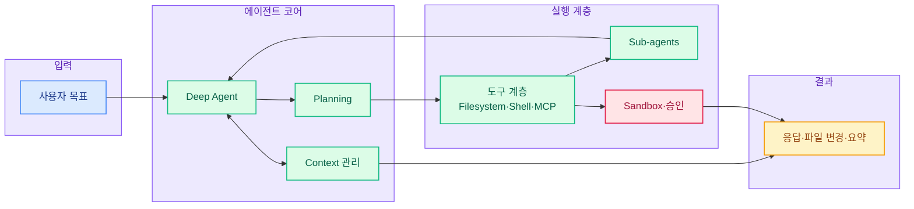
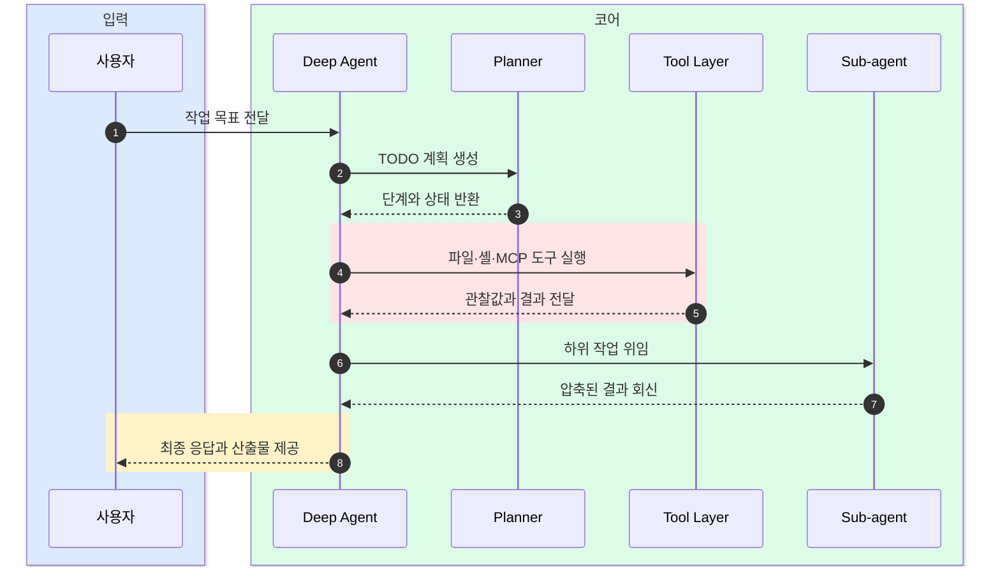

# Deep Agents: 즉시 실행 가능한 AI 에이전트 하네스

  Agent Harness
  Planning
  Filesystem/Shell
  Sub-agents
  LangGraph

## 한 문장 정의

  
One-Line Definition

  
Deep Agents는 계획 수립, 파일 작업, 셸 실행, 서브에이전트, 문맥 관리를 기본으로 갖춘 오픈소스 AI 에이전트 실행 프레임워크다.

## 원문 정보

  

    
원문 제목

    
The batteries-included agent harness.

  

  

    
카테고리

    
github

  

  

    
원문 링크

    
<a href="https://github.com/langchain-ai/deepagents">https://github.com/langchain-ai/deepagents</a>

  

## 3줄 요약

  
빠르게 읽는 요약

- Deep Agents는 프롬프트, 도구, 컨텍스트 처리를 처음부터 손으로 엮지 않아도 바로 동작하는 에이전트를 제공하는 'batteries-included' 스타일의 프로젝트다.
- 핵심 기능은 Planning, Filesystem, Shell access, Sub-agents, 스마트 기본 프롬프트, 자동 요약 기반의 Context management이며, 필요할 때만 모델·도구·프롬프트를 교체해 확장할 수 있다.
- LangGraph 기반으로 동작해 스트리밍, 체크포인트, 지속성 같은 운영 기능과 자연스럽게 연결되고, CLI를 통해 웹 검색·원격 샌드박스·승인 흐름 같은 실전 기능도 활용할 수 있다.

## 한눈에 보는 구조

  
Structure View

### Deep Agents의 상위 구조

  
Interaction Flow

### 요청부터 결과까지의 상호작용

## 핵심 포인트

1. 에이전트 조립 비용을 줄이는 것이 핵심 가치이며, 시작 단계에서 바로 쓸 수 있는 기본 구성이 강하다.
2. Planning 기능으로 작업을 TODO 단위로 나누고 진행 상태를 추적해 장기 작업의 통제력을 높인다.
3. Filesystem과 Shell 도구를 기본 제공해 코드 수정, 파일 탐색, 명령 실행이 섞인 개발 워크플로에 바로 적용하기 쉽다.
4. Sub-agents를 통해 하위 문제를 분리된 문맥 창에서 처리하고, 상위 에이전트는 요약된 결과만 받아 복잡도를 낮춘다.
5. 긴 대화는 자동 요약하고 큰 출력은 파일로 저장해 컨텍스트 창 낭비를 줄인다.
6. LangGraph Native 형태로 반환되므로 스트리밍, Studio, checkpointer 등 LangGraph 생태계와 결합하기 좋다.

## 읽는 순서

<ol class="poket-reading-list">
  <li class="poket-reading-item">1프로젝트 개요와 Quickstart</li>
  <li class="poket-reading-item">2기본 내장 기능 이해</li>
  <li class="poket-reading-item">3커스터마이징 포인트 확인</li>
  <li class="poket-reading-item">4CLI 기능과 운영 기능 살펴보기</li>
  <li class="poket-reading-item">5LangGraph Native 연결 방식 보기</li>
</ol>

## 활용 시나리오

  

코드베이스를 읽고 수정하며 필요한 셸 명령까지 실행하는 개발 보조 에이전트를 빠르게 구축할 때 유용하다.

  

문서, 설정 파일, 로그를 오가며 단계별 분석이 필요한 내부 운영 도우미를 만들 때 적합하다.

  

큰 작업을 하위 과제로 쪼개 여러 문맥으로 처리해야 하는 연구·분석형 에이전트 실험에 잘 맞는다.

  

승인, 샌드박스, 메모리, 원격 실행 같은 실전 기능을 포함한 CLI 기반 작업 자동화에 활용할 수 있다.

## 주요 개념

### Agent Harness

에이전트가 바로 일할 수 있도록 프롬프트, 도구, 실행 규칙, 상태 관리를 한데 묶어 제공하는 실행 틀이다.

### Planning

복잡한 요청을 작은 TODO 단계로 나누고 현재 진행 상황을 추적하는 작업 관리 계층이다.

### Sub-agent

상위 에이전트가 세부 작업을 위임하는 보조 에이전트로, 보통 분리된 문맥에서 일한 뒤 결과만 돌려준다.

### Context management

대화가 길어질 때 내용을 요약하거나 큰 출력을 파일로 빼서 모델 문맥을 효율적으로 쓰는 방식이다.

### LangGraph Native

Deep Agents가 LangGraph 그래프로 연결되도록 설계되어, 스트리밍·체크포인트·지속성 기능을 그대로 활용할 수 있다는 뜻이다.

### MCP

외부 도구나 시스템을 표준 방식으로 연결하기 위한 프로토콜 계열로, Deep Agents는 어댑터를 통해 이를 확장 지점으로 쓸 수 있다.

## 실무 관점

이 프로젝트의 실무적 의미는 '에이전트 기본기'를 직접 조립하는 시간을 줄이고, 계획·도구 호출·문맥 관리 같은 운영 핵심을 바로 검증 가능한 형태로 제공한다는 점에 있다.

## 추천 대상

파일 시스템과 셸을 다루는 개발자용 에이전트를 빠르게 만들고 싶거나, LangGraph 위에 운영 가능한 에이전트 계층을 얹고 싶은 팀에 특히 적합하다.

## 주의사항

- 파일 쓰기와 셸 실행이 기본 도구에 포함되므로, 실제 배포 전에는 권한 범위와 샌드박스 정책을 먼저 설계해야 한다.
- 자동 요약은 문맥 비용을 줄이지만 세부 근거가 압축될 수 있어, 중요한 판단에는 원문 검증 단계를 두는 편이 안전하다.
- 모델과 도구를 자유롭게 교체할 수 있지만, 공급자별 도구 호출 품질 차이와 실패 처리 전략은 별도로 점검해야 한다.
- CLI를 확장하는 경우 시작 속도를 해치지 않도록 무거운 의존성은 엔트리 경로에서 지연 로딩하는 것이 중요하다.
- 리포지토리에 기여할 때는 공개 API 안정성 유지와 단위 테스트 추가가 강한 기본 원칙으로 요구된다.

## 참고

- 이 문서는 원문을 바탕으로 재구성한 한국어 해설 문서입니다.
- 정확한 표현과 전체 맥락은 원문을 직접 확인하세요.
