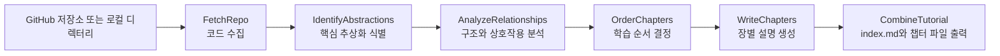

# GitHub 저장소를 초심자용 튜토리얼로 바꾸는 PocketFlow 기반 분석기

  PocketFlow
  GitHub repository analysis
  LLM tutorial generation
  Workflow
  Mermaid

## 원문 정보

  

    
원문 제목

    
Analyze a GitHub repository

  

  

    
카테고리

    
github

  

  

    
원문 링크

    
<a href="https://github.com/The-Pocket/PocketFlow-Tutorial-Codebase-Knowledge">https://github.com/The-Pocket/PocketFlow-Tutorial-Codebase-Knowledge</a>

  

## 3줄 요약

  
빠르게 읽는 요약

- 이 프로젝트는 GitHub 저장소나 로컬 디렉터리의 코드를 수집한 뒤, 핵심 추상화와 상호작용을 분석해 입문자 친화적인 튜토리얼 문서로 변환한다.
- PocketFlow를 바탕으로 `FetchRepo`부터 `CombineTutorial`까지의 워크플로를 구성하며, 코드베이스 구조·관계도·장별 설명을 자동 생성한다.
- 결과물은 프로젝트 요약, Mermaid 다이어그램, 챕터별 Markdown 파일로 정리되어 새로운 코드베이스 온보딩 시간을 크게 줄이는 데 초점이 있다.

## 코드베이스 분석에서 튜토리얼 생성까지의 흐름

## 핵심 포인트

1. 입력으로 GitHub URL 또는 로컬 경로를 받아 저장소 전체를 크롤링하고 필요한 파일만 필터링한다.
2. LLM을 사용해 코드베이스의 핵심 추상화, 관련 파일, 추상화 간 관계를 식별한다.
3. 학습 순서를 따로 계산해 초심자가 이해하기 쉬운 챕터 순서를 만든다.
4. 장 작성 단계는 `BatchNode` 방식으로 각 추상화를 독립적으로 설명해 병렬화와 구조화를 동시에 노린다.
5. 최종 산출물은 `index.md`, Mermaid 관계도, 개별 챕터 파일로 구성되어 읽기와 탐색이 쉽다.
6. LLM 공급자와 모델을 바꿔 쓸 수 있고, 캐시·출력 언어·포함/제외 패턴 같은 실무 옵션도 제공한다.

## 주요 개념

### FetchRepo

GitHub 저장소 또는 로컬 디렉터리에서 소스 파일을 읽어 분석 대상 목록으로 정리하는 시작 단계다.

### IdentifyAbstractions

코드베이스를 구성하는 핵심 개념, 역할, 관련 파일 묶음을 찾아 초심자 관점의 설명 단위로 바꾸는 단계다.

### AnalyzeRelationships

식별한 추상화들이 어떻게 연결되고 협력하는지 요약해 프로젝트 전체 구조를 설명하는 단계다.

### BatchNode

각 추상화별 챕터 작성을 독립 작업처럼 처리하는 방식으로, 반복 생성 작업을 구조적으로 나누는 데 쓰인다.

### CombineTutorial

요약, 다이어그램, 챕터 링크, 개별 문서를 하나의 튜토리얼 산출물 디렉터리로 조립하는 마지막 단계다.

### LLM response caching

같은 프롬프트 결과를 재사용해 비용과 시간을 줄이는 기능으로, 반복 실험 시 특히 유용하다.

## 실무 관점

문서가 부족한 내부 저장소나 오픈소스를 빠르게 학습해야 할 때, 이 프로젝트는 코드 탐색 자체를 자동 요약·시각화·튜토리얼화하는 파이프라인의 좋은 출발점이 된다. 특히 온보딩 자료 초안 생성, 사내 프레임워크 설명서 자동화, 다국어 기술 문서 생성 실험에 바로 응용할 수 있다.

## 추천 대상

처음 보는 저장소를 빠르게 이해해야 하는 개발자, 신규 팀원 온보딩 자료를 만들고 싶은 팀, 코드 분석형 AI 워크플로를 설계하려는 LLM 엔지니어에게 적합하다.

## 주의사항

- 생성된 설명은 이해를 돕는 초안이므로, 실제 동작과 설계 의도는 원본 코드와 함께 검증해야 한다.
- 모델 품질이 낮거나 프롬프트가 부정확하면 핵심 추상화 구분이 흐려질 수 있다.
- 매우 큰 저장소에서는 파일 필터링과 최대 크기 제한을 잘 설정하지 않으면 비용과 시간이 급증할 수 있다.
- 비공개 저장소 분석 시 `GITHUB_TOKEN`과 LLM API 키 관리가 중요하다.
- 초심자 친화적 설명에 초점을 두므로, 세부 구현이나 예외 경로 분석은 별도 보완이 필요하다.

## 참고

- 이 문서는 원문을 바탕으로 재구성한 한국어 해설 문서입니다.
- 정확한 표현과 전체 맥락은 원문을 직접 확인하세요.
