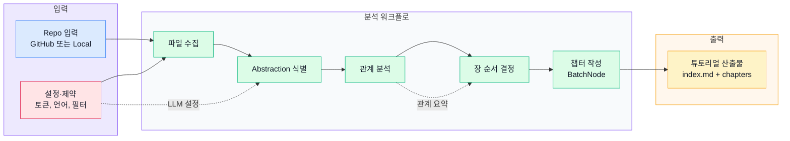
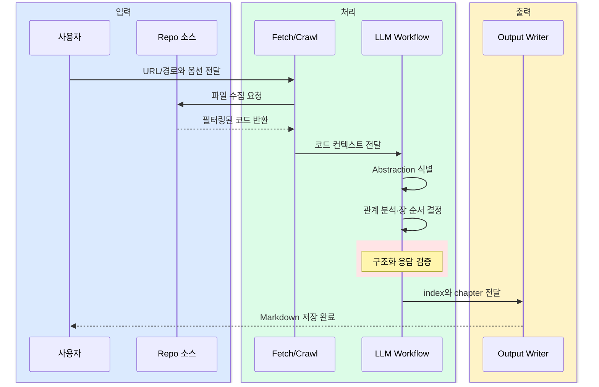

# GitHub 저장소를 분석해 초보자용 튜토리얼로 바꾸는 Pocket Flow 예제

  Pocket Flow
  GitHub 저장소 분석
  Workflow 파이프라인
  BatchNode
  LLM 튜토리얼 생성

## 한 문장 정의

  
One-Line Definition

  
이 프로젝트는 GitHub 저장소나 로컬 코드베이스를 읽어 핵심 개념과 관계를 정리하고, 이를 초보자도 따라갈 수 있는 Markdown 튜토리얼로 바꾸는 Pocket Flow 기반 예제다.

## 원문 정보

  

    
원문 제목

    
Analyze a GitHub repository

  

  

    
카테고리

    
github

  

  

    
원문 링크

    
<a href="https://github.com/The-Pocket/PocketFlow-Tutorial-Codebase-Knowledge">https://github.com/The-Pocket/PocketFlow-Tutorial-Codebase-Knowledge</a>

  

## 3줄 요약

  
빠르게 읽는 요약

- 저장소의 파일을 수집한 뒤 코드베이스의 핵심 abstraction을 뽑아내고, 관계와 학습 순서를 정리해 사람이 읽기 쉬운 튜토리얼로 변환한다.
- 전체 구조는 Workflow 중심으로 설계되어 있으며, 특히 챕터 작성은 BatchNode 방식으로 abstraction별 내용을 독립 처리한다.
- GitHub URL과 로컬 디렉터리 입력, LLM provider 교체, 캐시, 파일 필터링, Docker 실행까지 포함해 실제 문서화 자동화 흐름을 재현한다.

## 한눈에 보는 구조

  
Structure View

### 튜토리얼 생성 워크플로

  
Interaction Flow

### 저장소에서 Markdown 튜토리얼까지

## 핵심 포인트

1. 입력은 GitHub repo URL 또는 로컬 디렉터리이며, 둘 중 하나를 선택해 분석을 시작한다.
2. 파일 수집 단계에서 include, exclude, 최대 파일 크기 설정으로 분석 범위를 통제할 수 있다.
3. LLM은 abstraction 식별, 관계 분석, 장 순서 결정, 챕터 작성 등 핵심 사고 단계를 담당한다.
4. 중간 결과는 shared store에 축적되어 단계 간 데이터 전달과 중복 최소화를 돕는다.
5. WriteChapters는 BatchNode 패턴으로 각 abstraction을 개별 챕터로 생성해 병렬적 사고 구조를 만든다.
6. 최종 결과는 `index.md`와 번호가 매겨진 chapter Markdown 파일들로 저장된다.

## 읽는 순서

<ol class="poket-reading-list">
  <li class="poket-reading-item">1입력 옵션과 실행 방식 파악</li>
  <li class="poket-reading-item">2Workflow 전체 단계 이해</li>
  <li class="poket-reading-item">3핵심 유틸리티와 shared store 확인</li>
  <li class="poket-reading-item">4WriteChapters와 출력 파일 구조 보기</li>
</ol>

## 활용 시나리오

  

신규 팀원이 큰 레포를 빠르게 이해할 수 있도록 온보딩용 학습 문서 초안을 만들 때 유용하다.

  

사내 프레임워크나 레거시 서비스의 구조를 설명하는 내부 위키 초안을 자동화할 때 적합하다.

  

오픈소스 저장소를 교육 자료, 발표 자료, 블로그용 요약 문서로 재가공할 때 활용할 수 있다.

  

private repo를 제한된 파일 범위만 분석해 기술 인수인계용 개요 문서를 만들 때 실무 가치가 크다.

## 주요 개념

### Workflow

파일 수집부터 튜토리얼 출력까지를 순차 단계로 나눠 실행하는 핵심 처리 패턴이다.

### BatchNode

식별된 abstraction 각각을 독립적으로 처리해 챕터를 생성하는 MapReduce 성격의 노드다.

### Abstraction

코드베이스를 설명할 때 중심이 되는 개념, 역할, 모듈 단위를 뜻한다.

### shared store

각 노드가 중간 산출물을 읽고 쓰는 공용 데이터 저장소로, 단계 간 연결점 역할을 한다.

### call_llm

모델 제공자 설정에 따라 LLM을 호출해 분석과 글쓰기를 수행하는 공통 유틸리티다.

### crawl_github_files

GitHub 저장소에서 파일을 가져오고 필터링해 분석 가능한 코드 집합으로 만드는 수집 유틸리티다.

## 실무 관점

이 예제의 핵심 가치는 단순 요약이 아니라, 복잡한 코드베이스를 학습 가능한 순서와 문서 형식으로 재구성하는 자동 설명 파이프라인을 보여준다는 점이다.

## 추천 대상

복잡한 레포를 빠르게 이해해야 하는 개발자, 온보딩 문서를 자동화하려는 팀, DevRel·교육 콘텐츠 제작자에게 특히 적합하다.

## 주의사항

- 결과 품질은 사용한 LLM의 추론 성능과 프롬프트 안정성에 크게 좌우된다.
- YAML 같은 구조화 출력에 의존하므로 모델 응답이 흔들리면 파싱 실패나 재시도가 발생할 수 있다.
- 대형 저장소는 include/exclude와 최대 파일 크기 제한 없이 돌리면 비용과 잡음이 빠르게 커진다.
- 자동 생성된 튜토리얼은 학습용 문서에 강하지만, 정확한 설계 명세나 보안 검토를 완전히 대체하지는 않는다.
- private repo나 Docker 실행 환경에서는 GitHub token과 API 키를 안전하게 주입하고 관리해야 한다.

## 참고

- 이 문서는 원문을 바탕으로 재구성한 한국어 해설 문서입니다.
- 정확한 표현과 전체 맥락은 원문을 직접 확인하세요.
