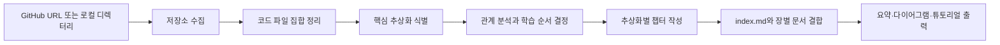
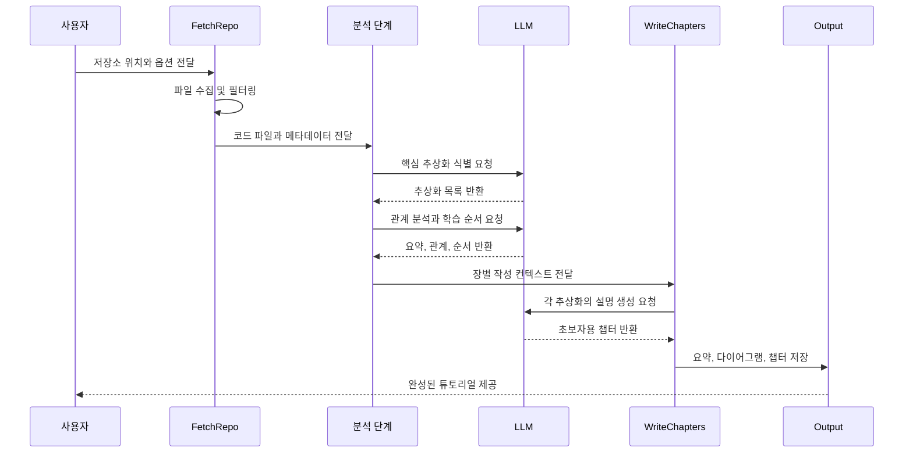

# GitHub 저장소를 입문용 튜토리얼로 바꾸는 PocketFlow 예제

  PocketFlow
  GitHub 저장소 분석
  코드 온보딩
  LLM 기반 문서화
  Mermaid 시각화

## 한 문장 정의

  
One-Line Definition

  
이 프로젝트는 GitHub 저장소나 로컬 코드 디렉터리를 읽어 핵심 구조와 상호작용을 정리한 초보자용 튜토리얼 문서를 자동 생성하는 PocketFlow 기반 예제다.

## 원문 정보

  

    
원문 제목

    
Analyze a GitHub repository

  

  

    
카테고리

    
github

  

  

    
원문 링크

    
<a href="https://github.com/The-Pocket/PocketFlow-Tutorial-Codebase-Knowledge">https://github.com/The-Pocket/PocketFlow-Tutorial-Codebase-Knowledge</a>

  

## 3줄 요약

  
빠르게 읽는 요약

- 코드 저장소를 수집한 뒤 LLM으로 핵심 추상화와 관계를 뽑아 사람이 읽기 쉬운 설명으로 바꾼다.
- 결과물은 프로젝트 요약, Mermaid 다이어그램, 장별 문서로 구성되어 신규 개발자의 코드베이스 이해 속도를 높인다.
- GitHub URL과 로컬 디렉터리를 모두 지원하며 언어, 파일 필터, 출력 위치, 캐시 사용 여부 등을 조절할 수 있다.

## 한눈에 보는 구조

  
Structure View

### 코드 저장소에서 튜토리얼 산출물까지의 상위 흐름

  
Interaction Flow

### 튜토리얼 생성 시 주요 구성요소의 상호작용

## 핵심 포인트

1. 전체 흐름은 저장소 수집 → 핵심 추상화 식별 → 관계 분석 → 학습 순서 결정 → 장별 작성 → 튜토리얼 결합의 Workflow 패턴으로 설계된다.
2. 핵심 개념을 단순 파일 나열이 아니라 추상화 단위로 묶어 설명하므로 코드 구조를 상위 수준에서 파악하기 좋다.
3. 장 작성 단계는 각 추상화를 독립적으로 처리하는 BatchNode 성격을 띠어 병렬적 사고와 MapReduce식 분해에 가깝다.
4. 출력은 `index.md`, 챕터 파일들, 관계 다이어그램으로 구성되어 문서형 산출물로 바로 활용할 수 있다.
5. LLM 제공자는 환경 변수로 바꿀 수 있어 Gemini, XAI, Ollama 등 환경에 맞는 설정이 가능하다.
6. GitHub 토큰, 포함·제외 패턴, 최대 파일 크기 같은 옵션이 있어 대형 저장소나 사설 저장소 분석에도 대응한다.

## 읽는 순서

<ol class="poket-reading-list">
  <li class="poket-reading-item">1입력과 출력 형태 파악</li>
  <li class="poket-reading-item">2Workflow 단계 이해</li>
  <li class="poket-reading-item">3추상화와 관계 분석 보기</li>
  <li class="poket-reading-item">4챕터 생성 방식 확인</li>
  <li class="poket-reading-item">5실무 적용 범위 판단</li>
</ol>

## 활용 시나리오

  

새 팀원이 대규모 레거시 저장소에 합류할 때 핵심 구조를 빠르게 익히는 온보딩 자료를 만들 때 유용하다.

  

오픈소스 후보를 검토할 때 전체 구조와 주요 컴포넌트 관계를 짧은 시간 안에 파악하는 데 도움이 된다.

  

사내 프레임워크나 플랫폼 저장소의 문서가 부족할 때 자동 초안과 시각 자료를 생성하는 기반으로 쓸 수 있다.

  

교육용 실습에서 복잡한 프로젝트를 초급자용 튜토리얼 형식으로 재구성해 학습 진입 장벽을 낮출 수 있다.

## 주요 개념

### PocketFlow

작은 코드량으로 에이전트형 LLM 워크플로를 구성하도록 만든 경량 프레임워크다.

### Workflow

여러 분석 단계를 순차적으로 연결해 하나의 결과물을 만드는 처리 방식이다.

### BatchNode

여러 항목을 같은 규칙으로 각각 처리하는 노드로, 여기서는 추상화별 챕터 작성에 쓰인다.

### Abstraction

개별 파일보다 높은 수준의 핵심 개념 단위로, 시스템을 이해하기 쉽게 묶은 설명 대상이다.

### Mermaid

문서 안에서 구조도와 시퀀스 다이어그램을 텍스트로 표현할 수 있게 해주는 다이어그램 문법이다.

### call_llm

프로젝트에서 LLM 호출을 담당하는 유틸리티로, 분석과 문서 생성의 공통 엔진 역할을 한다.

## 실무 관점

이 예제의 핵심 가치는 코드 검색 도구를 하나 더 만드는 데 있지 않고, 복잡한 저장소를 사람이 학습 가능한 설명 단위로 재구성해 온보딩 문서 생산성을 크게 높인다는 점에 있다.

## 추천 대상

새 코드베이스를 빠르게 이해해야 하는 개발자, 사내 문서 자동화를 고민하는 플랫폼 팀, 저장소 분석형 AI 에이전트를 설계하려는 엔지니어에게 특히 적합하다.

## 주의사항

- 생성 문서의 품질은 선택한 LLM의 추론 능력과 프롬프트 품질에 크게 좌우된다.
- 자동 요약은 유용하지만 도메인 규칙이나 예외 처리 맥락까지 완벽히 보장하지는 않는다.
- 대형 저장소는 포함·제외 패턴과 최대 파일 크기 설정이 없으면 비용과 잡음이 빠르게 커질 수 있다.
- 사설 저장소 분석에는 `GITHUB_TOKEN` 같은 인증 구성이 필요하며, 민감 코드 처리 정책도 함께 고려해야 한다.
- 튜토리얼은 빠른 이해를 돕는 보조 수단이지, 최종 검증 없이 원본 코드 읽기를 완전히 대체하지는 않는다.

## 참고

- 이 문서는 원문을 바탕으로 재구성한 한국어 해설 문서입니다.
- 정확한 표현과 전체 맥락은 원문을 직접 확인하세요.
