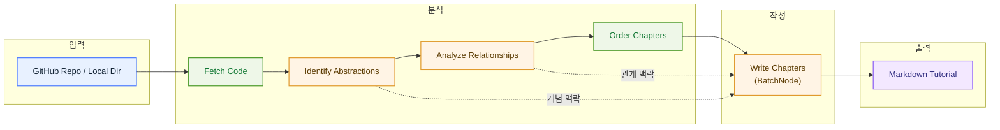
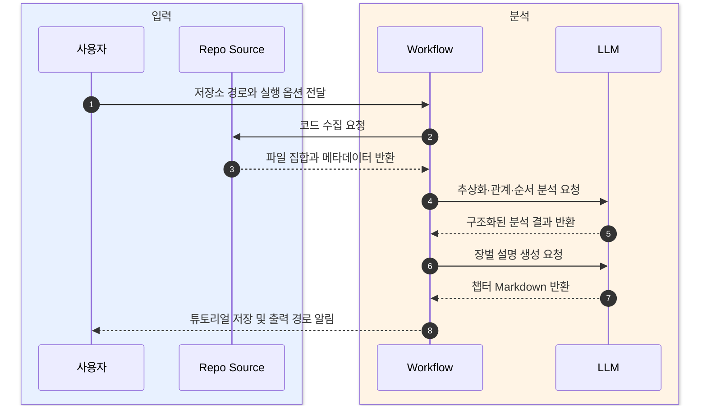

# GitHub 저장소를 초보자용 튜토리얼로 분석하는 Pocket Flow 프로젝트

  Pocket Flow
  코드베이스 분석
  Workflow 파이프라인
  BatchNode
  튜토리얼 자동 생성

## 한 문장 정의

  
One-Line Definition

  
이 프로젝트는 GitHub 저장소나 로컬 코드베이스를 읽어 핵심 구조를 파악하고, 사람이 따라 읽기 쉬운 튜토리얼 문서로 자동 정리하는 AI 워크플로 예제다.

## 원문 정보

  

    
원문 제목

    
Analyze a GitHub repository

  

  

    
카테고리

    
github

  

  

    
원문 링크

    
<a href="https://github.com/The-Pocket/PocketFlow-Tutorial-Codebase-Knowledge">https://github.com/The-Pocket/PocketFlow-Tutorial-Codebase-Knowledge</a>

  

## 3줄 요약

  
빠르게 읽는 요약

- Pocket Flow 기반의 튜토리얼 프로젝트로, 코드베이스를 지식베이스로 바꾼 뒤 학습용 설명 문서로 재구성한다.
- 처리는 `fetch -> identify abstractions -> analyze relationships -> order chapters -> write chapters -> combine files` 순서의 Workflow로 진행된다.
- GitHub URL과 로컬 디렉터리를 모두 지원하며, LLM 설정·언어·필터링·출력 경로 같은 실무형 옵션을 함께 제공한다.

## 한눈에 보는 구조

  
Structure View

### 튜토리얼 생성 파이프라인 개요

  
Interaction Flow

### 저장소에서 튜토리얼 파일까지의 상호작용

## 핵심 포인트

1. 입력 단계에서 GitHub 저장소와 로컬 디렉터리를 모두 다루며, 파일 크기 제한과 포함·제외 패턴으로 분석 범위를 제어한다.
2. 핵심 로직은 LLM을 사용해 코드베이스의 주요 추상화와 추상화 사이의 관계를 구조화된 형태로 추출하는 데 있다.
3. `OrderChapters` 단계가 개념의 중요도와 의존성을 반영해 학습 순서를 정하므로, 단순 요약이 아니라 읽기 흐름까지 설계한다.
4. `WriteChapters`는 `BatchNode` 방식으로 각 추상화를 독립 처리해 장별 설명을 만들고, 이후 하나의 튜토리얼로 합친다.
5. 최종 산출물은 `index.md`와 장별 Markdown 파일이라서 문서화, 온보딩, 교육 자료 초안으로 바로 활용하기 쉽다.
6. `.env`, Docker, GitHub token, 여러 LLM provider 설정을 지원해 로컬 실험부터 비공개 저장소 분석까지 확장 가능하다.
7. MIT 라이선스로 공개돼 팀 내부 도구 실험이나 문서 자동화 프로토타입의 참고 구현으로 쓰기 좋다.

## 읽는 순서

<ol class="poket-reading-list">
  <li class="poket-reading-item">1프로젝트 목적과 입력 범위 이해</li>
  <li class="poket-reading-item">2LLM 설정과 실행 옵션 확인</li>
  <li class="poket-reading-item">3Workflow 단계별 책임 파악</li>
  <li class="poket-reading-item">4`BatchNode` 기반 챕터 생성 읽기</li>
  <li class="poket-reading-item">5최종 Markdown 출력 구조 확인</li>
</ol>

## 활용 시나리오

  

처음 맡은 오픈소스 저장소의 구조를 빠르게 이해해야 하는 온보딩 문서 초안을 만들 때 유용하다.

  

사내 레포지토리의 암묵적 설계를 팀 위키나 교육 자료로 바꾸는 자동화 파이프라인의 출발점으로 쓰기 좋다.

  

개발자 교육, 스터디, 코드랩에서 복잡한 프로젝트를 장별 개념 설명 형태로 재구성할 때 도움이 된다.

  

비공개 저장소나 로컬 프로젝트를 대상으로 내부 지식베이스와 설명형 문서를 함께 생성하는 실험에 적합하다.

## 주요 개념

### Pocket Flow

작은 코드량으로 LLM 워크플로를 구성할 수 있게 만든 프레임워크로, 이 프로젝트의 전체 실행 틀이다.

### Workflow

저장소 수집부터 튜토리얼 출력까지를 순차 단계로 나눈 처리 방식으로, 각 단계의 책임을 분리해 안정성을 높인다.

### BatchNode

여러 항목을 개별적으로 처리한 뒤 결과를 모으는 패턴으로, 여기서는 추상화별 챕터 작성에 사용된다.

### abstraction

코드베이스를 이해하기 쉽게 묶은 핵심 개념 단위로, 클래스 하나일 수도 있고 기능 묶음일 수도 있다.

### shared Store

각 노드가 읽고 쓰는 공용 데이터 공간으로, 추상화 목록·관계·챕터 순서·출력 경로 같은 중간 결과를 담는다.

### `call_llm`

LLM provider를 추상화한 호출 유틸리티로, 추상화 식별·관계 분석·순서 결정·챕터 작성에서 공통으로 사용된다.

## 실무 관점

핵심 가치는 코드를 바로 요약하지 않고, 수집·추상화·관계 분석·학습 순서 결정·장 생성으로 분해해 LLM이 더 안정적으로 설명 가능한 산출물을 만들게 한 점이다.

## 추천 대상

새 코드베이스 온보딩을 자동화하려는 개발자, AI 기반 문서화 파이프라인을 설계하는 엔지니어, Pocket Flow 예제로 Workflow 패턴을 배우려는 독자에게 추천한다.

## 주의사항

- LLM 품질에 따라 추상화 식별과 관계 설명의 정확도가 달라질 수 있다.
- 대형 저장소는 토큰 비용, 실행 시간, 컨텍스트 제한 문제를 크게 만든다.
- 포함·제외 패턴이나 파일 크기 제한을 잘못 잡으면 중요한 코드가 누락될 수 있다.
- 비공개 저장소 분석 시 GitHub token과 API 키 관리가 필수다.
- 생성된 튜토리얼은 초안으로 보고, 실제 아키텍처와의 차이를 사람이 검토해야 한다.

## 참고

- 이 문서는 원문을 바탕으로 재구성한 한국어 해설 문서입니다.
- 정확한 표현과 전체 맥락은 원문을 직접 확인하세요.
