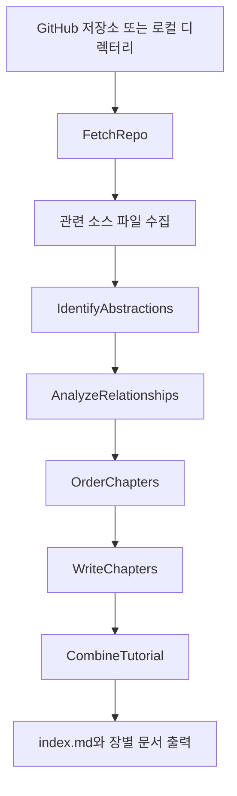
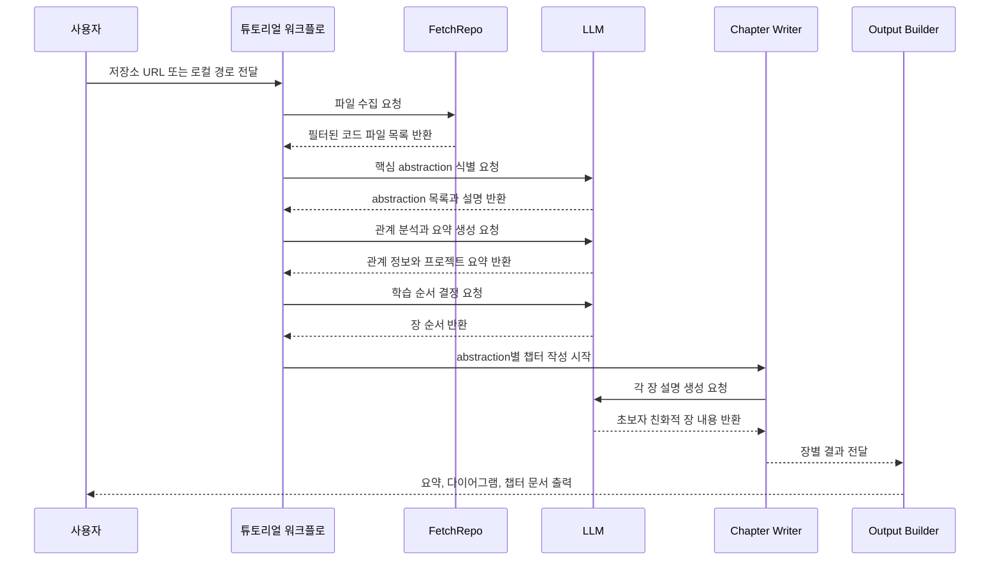

# GitHub 저장소를 초보자용 튜토리얼로 바꾸는 PocketFlow 프로젝트

  PocketFlow
  코드베이스 분석
  튜토리얼 자동 생성
  Workflow
  Mermaid 다이어그램

## 한 문장 정의

  
One-Line Definition

  
이 문서는 GitHub 저장소나 로컬 코드 디렉터리를 분석해 사람이 읽기 쉬운 튜토리얼 문서로 자동 변환하는 AI 에이전트 튜토리얼 프로젝트를 설명한다.

## 원문 정보

  

    
원문 제목

    
Analyze a GitHub repository

  

  

    
카테고리

    
github

  

  

    
원문 링크

    
<a href="https://github.com/The-Pocket/PocketFlow-Tutorial-Codebase-Knowledge">https://github.com/The-Pocket/PocketFlow-Tutorial-Codebase-Knowledge</a>

  

## 3줄 요약

  
빠르게 읽는 요약

- 이 프로젝트는 코드베이스 전체를 훑어 핵심 추상화와 상호작용을 찾아낸 뒤, 입문자도 이해할 수 있는 튜토리얼 형태로 재구성한다.
- 흐름은 저장소 수집, 핵심 개념 식별, 관계 분석, 학습 순서 결정, 챕터 작성, 최종 문서 결합의 순차적 Workflow로 설계되어 있다.
- 출력물은 요약, Mermaid 시각화, 챕터별 설명 문서로 구성되어 신규 개발자의 온보딩과 코드 이해 시간을 줄이는 데 초점이 있다.

## 한눈에 보는 구조

  
Structure View

### 코드 저장소에서 튜토리얼 산출물까지의 전체 흐름

  
Interaction Flow

### 사용자 요청부터 튜토리얼 생성까지의 상호작용

## 핵심 포인트

1. 입력은 GitHub URL 또는 로컬 디렉터리이며, 프로젝트 이름과 출력 언어를 선택적으로 지정할 수 있다.
2. 코드 파일을 수집한 뒤 LLM이 핵심 abstraction을 식별하고, 각 abstraction과 관련된 파일 묶음을 기반으로 설명을 생성한다.
3. 관계 분석 단계에서 프로젝트 전체 요약과 abstraction 간 연결 구조를 만들고, 이를 Mermaid 다이어그램으로 시각화한다.
4. 챕터 순서를 자동으로 정해 학습 흐름을 구성하므로 독자가 어디서부터 읽어야 할지 바로 파악할 수 있다.
5. WriteChapters 단계는 abstraction별 병렬적 처리 개념을 활용해 각 주제를 독립적으로 정리하면서도 전체 튜토리얼로 결합한다.
6. PocketFlow 기반의 비교적 작은 프레임워크 예제로, 에이전트형 문서화 파이프라인을 학습하기 좋은 구조를 제공한다.

## 읽는 순서

<ol class="poket-reading-list">
  <li class="poket-reading-item">1프로젝트 목적과 입력/출력 이해</li>
  <li class="poket-reading-item">2Workflow 단계별 역할 파악</li>
  <li class="poket-reading-item">3핵심 유틸리티와 LLM 사용 방식 확인</li>
  <li class="poket-reading-item">4챕터 생성과 결합 결과물 보기</li>
</ol>

## 활용 시나리오

  

새 팀원이 대형 저장소에 합류할 때 구조 설명 문서를 빠르게 초안으로 만들 때 유용하다.

  

사내 프레임워크나 오픈소스 프로젝트의 학습용 가이드를 자동 생성해 온보딩 비용을 줄일 수 있다.

  

여러 저장소를 비교 분석하면서 공통 abstraction과 설계 패턴을 교육 자료로 정리할 때 활용할 수 있다.

## 주요 개념

### abstraction

코드 전체에서 반복적으로 중요한 역할을 하는 핵심 개념 단위를 뜻하며, 튜토리얼의 각 장 주제가 된다.

### Workflow

여러 분석 단계를 정해진 순서로 연결해 결과를 만드는 처리 방식으로, 이 프로젝트의 기본 실행 모델이다.

### BatchNode

여러 abstraction을 각각 독립적으로 처리하는 단계로, 챕터 작성 작업을 나눠 수행하는 데 쓰인다.

### Mermaid

문서 안에서 구조도와 흐름도를 텍스트로 표현하는 도구로, abstraction 관계를 시각화하는 데 사용된다.

### LLM caching

같은 요청에 대한 모델 응답을 재사용해 비용과 시간을 줄이는 방식으로, 반복 실행 시 효율을 높여 준다.

### include/exclude patterns

어떤 파일을 분석 대상에 넣거나 뺄지 정하는 필터 규칙으로, 불필요한 파일을 줄여 분석 품질을 높인다.

## 실무 관점

실무적으로는 코드 검색 도구를 하나 더 만드는 프로젝트라기보다, 낯선 저장소를 교육 가능한 문서로 바꾸는 자동 해설 파이프라인에 가깝다.

## 추천 대상

신규 코드베이스 온보딩 문서를 빨리 만들어야 하는 개발자, 개발 생산성 도구를 설계하는 엔지니어, LLM 기반 문서화 워크플로를 학습하려는 사람에게 적합하다.

## 주의사항

- 생성 결과의 정확성은 LLM 품질과 프롬프트 설계에 영향을 크게 받으므로 핵심 설명은 사람이 검토해야 한다.
- include/exclude 설정이 부정확하면 테스트 코드나 문서 파일이 과도하게 섞여 핵심 구조 파악이 흐려질 수 있다.
- 대형 저장소에서는 API 비용, 실행 시간, 토큰 사용량이 빠르게 증가할 수 있다.
- 초보자 친화적 설명에 집중하므로 세밀한 구현 세부나 예외 처리까지 완전하게 담아내지는 못할 수 있다.

## 참고

- 이 문서는 원문을 바탕으로 재구성한 한국어 해설 문서입니다.
- 정확한 표현과 전체 맥락은 원문을 직접 확인하세요.
