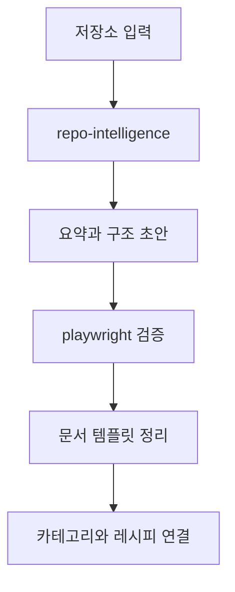

# 저장소 분석 레시피

## 목적

낯선 저장소를 빠르게 이해하고 문서화 초안을 만든다.

## 입력 체크리스트

- 저장소 URL 또는 로컬 경로
- UI 존재 여부
- 최종 산출물이 위키인지, 요약 문서인지
- 확인해야 할 핵심 흐름

## 권장 조합

1. `repo-intelligence`로 구조와 요약 초안 생성
2. `playwright`로 실제 UI 흐름이 있으면 동작 확인
3. 생성된 Markdown을 사이트 문서로 편집

## 단계별 실행

### 1단계

`repo-intelligence`로 저장소 목적, 구조, 핵심 파일, 다이어그램 초안을 확보한다.

### 2단계

UI가 있는 프로젝트면 `playwright` 또는 `playwright-interactive`로 실제 동작을 확인한다.

### 3단계

문서 템플릿에 맞게 요약, 튜토리얼, 관련 링크를 정리한다.

### 4단계

카테고리와 레시피 문서에서 재사용할 수 있게 링크를 연결한다.

## 결과물

- 저장소 요약
- 구조 다이어그램
- 온보딩용 튜토리얼 초안

## 실패하기 쉬운 지점

- README만 보고 구현 구조를 추정하는 경우
- UI 검증 없이 문서만 작성하는 경우
- 원문 링크와 증거를 남기지 않는 경우

## Mermaid

