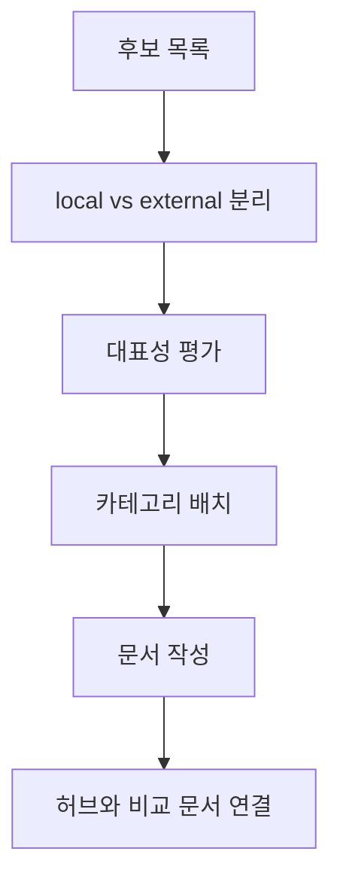

# 스킬 카탈로그 큐레이션 레시피

## 목적

로컬 skill과 외부 저장소를 함께 다루는 사이트에서 어떤 문서를 우선 추가할지 판단하고, 중복 없이 큐레이션하는 기준을 만든다.

## 입력 체크리스트

- 후보 skill 또는 저장소 목록
- 공식성 여부
- 재사용성
- 카테고리 적합성
- 한국어 정리 가치

## 권장 흐름

1. 후보를 `local`과 `external`로 나눈다.
2. 공식 또는 표준 역할을 하는 저장소를 우선 올린다.
3. 같은 목적의 도구는 비교 가능하도록 묶는다.
4. 문서가 10개를 넘으면 허브와 비교 문서를 강화한다.

## 단계별 실행

### 1단계

후보를 `Codex`, `Generic`, `Docs`, `Testing`, `MCP` 축으로 분류한다.

### 2단계

로컬에서 직접 검증 가능한 문서를 먼저 추가하고, 이후 외부 저장소를 대표성 기준으로 보강한다.

### 3단계

각 문서를 같은 템플릿으로 작성해 비교 비용을 낮춘다.

### 4단계

레퍼런스 허브와 카테고리 문서에서 추천 조합과 비교 기준을 제공한다.

## 결과물

- 우선순위가 정리된 후보 목록
- 중복 없는 문서 집합
- 카테고리별 추천 링크

## Mermaid

