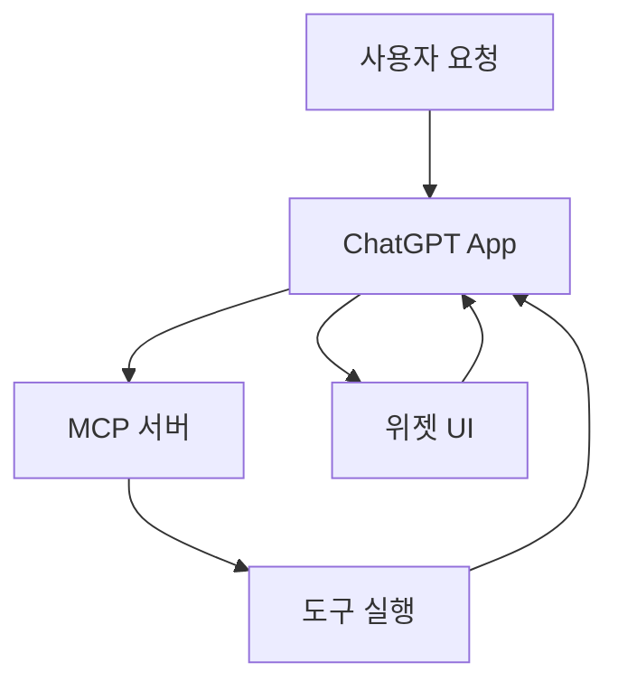

# chatgpt-apps

## 한줄 요약

ChatGPT Apps SDK 애플리케이션에서 MCP 서버, 위젯 UI, 도구 브리지를 설계하고 연결하는 skill이다.

## 분류

- Agent: `Codex`
- Purpose: `mcp`
- Shape: `single skill`

## 언제 쓰는가

- ChatGPT App 구조를 설계할 때
- MCP 도구와 프런트엔드 위젯을 함께 다뤄야 할 때
- SDK 메타데이터와 도메인 설정이 필요한 경우

## 입력과 출력

- 입력: 앱 요구사항, 도구 정의, UI 요구사항
- 출력: 앱 구조안, 등록 코드, 브리지 연결 패턴

## Mermaid

## 장점

- 앱 구조와 도구 연결을 한 흐름에서 다룰 수 있다.
- 문서 우선 접근을 권장해 설계 오류를 줄이기 쉽다.

## 한계

- SDK와 플랫폼 변경에 영향을 받을 수 있다.
- 브리지와 메타데이터 규칙 이해가 필요하다.

