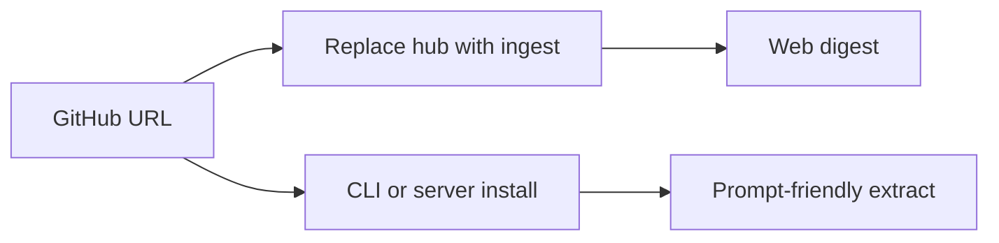

# Gitingest

## 한줄 요약

GitHub URL에서 빠르게 prompt-friendly 코드베이스 추출본을 만드는 인제스트 도구다.

## 분류

- Agent: `Generic`
- Purpose: `docs`
- Shape: `repository`

## 언제 참고하는가

- GitHub 저장소를 빠르게 LLM 입력용으로 요약하고 싶을 때
- 웹 URL 변환 기반의 단순 UX를 참고하고 싶을 때
- CLI와 웹을 같이 제공하는 ingest 도구를 비교하고 싶을 때

## 입력과 출력

- 입력: GitHub URL 또는 CLI 인자
- 출력: prompt-friendly extract, 웹 digest, CLI 기반 추출 결과

## 핵심 구조

- GitHub URL의 `hub`를 `ingest`로 바꾸는 간단한 접근
- `pip` 또는 `pipx` 설치
- 브라우저 확장과 웹 서비스 제공
- self-hosting용 서버 의존성 옵션

## Mermaid

## 장점

- 진입 장벽이 매우 낮다.
- URL 기반 UX가 직관적이다.
- CLI, 웹, 브라우저 확장으로 접근 방식이 다양하다.

## 한계

- 세밀한 구조 분석보다는 빠른 추출에 가깝다.
- 복잡한 문서 묶음 생성은 별도 도구가 더 적합할 수 있다.

## 링크

- 저장소: [coderamp-labs/gitingest](https://github.com/coderamp-labs/gitingest)
- 근거: GitHub README 기준 prompt-friendly extract 도구
