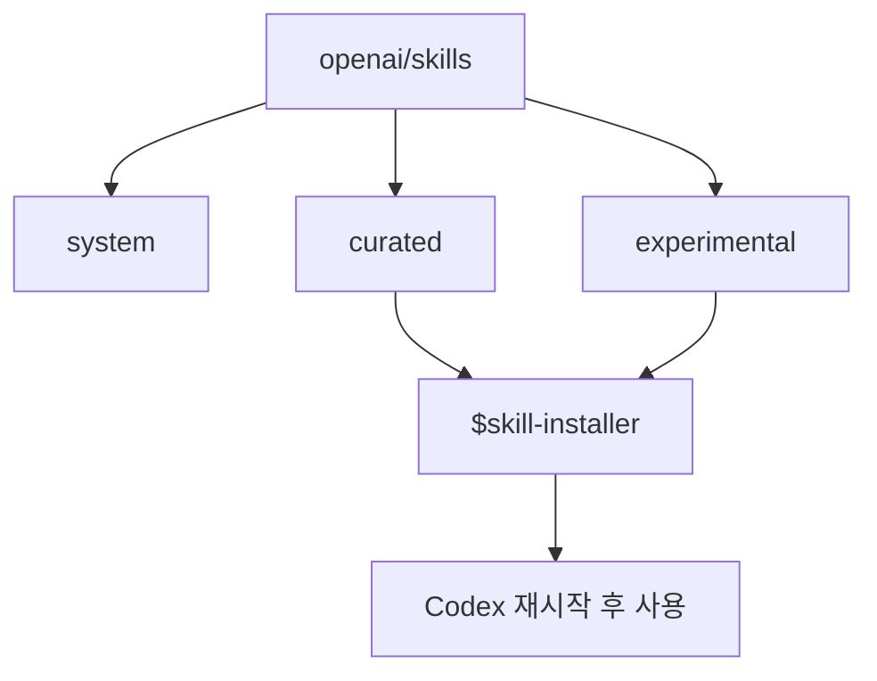
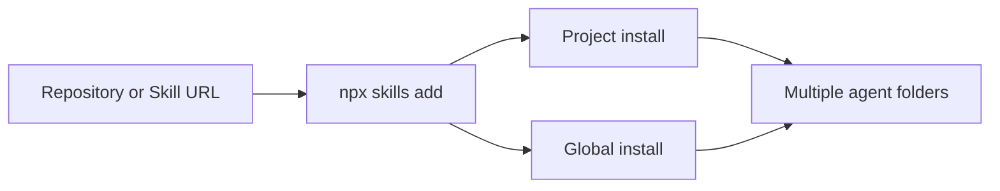
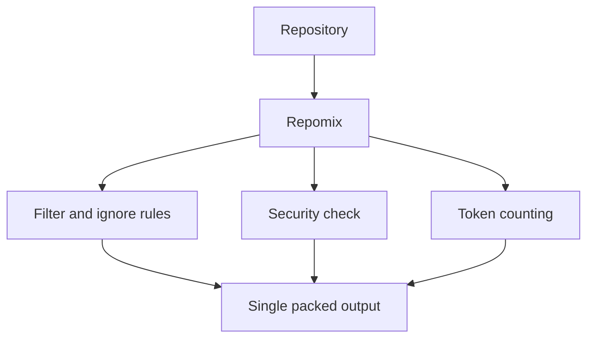
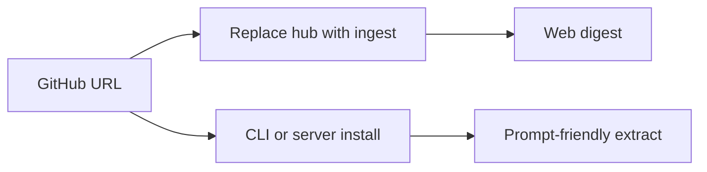

# openai/skills

## 한줄 요약

`Codex`용 공식 skill 카탈로그 성격을 가진 저장소로, skill 배포와 사용 패턴의 기준점 역할을 한다.

## 분류

- Agent: `Codex`
- Purpose: `docs`
- Shape: `repository`

## 언제 참고하는가

- `Codex` 스킬 구조의 기준 사례가 필요할 때
- curated, experimental, system 스킬 구성을 이해하고 싶을 때
- 로컬 skill 사이트에서 공식 레퍼런스 축을 잡고 싶을 때

## 입력과 출력

- 입력: GitHub 저장소, skill 폴더, 설치 경로
- 출력: `Codex`에서 재사용 가능한 skill 카탈로그와 설치 가능한 skill 세트

## 핵심 구조

- `skills/.system`: 기본 제공 계열
- `skills/.curated`: 설치 추천 계열
- `skills/.experimental`: 실험적 계열
- `$skill-installer`와 연계한 배포 흐름

## Mermaid

## 장점

- `Codex` skill 생태계의 사실상 기준 저장소다.
- 설치 흐름과 폴더 체계가 명확하다.
- 문서화 사이트에서 비교 축으로 쓰기 좋다.

## 한계

- `Codex` 중심이어서 타 agent 생태계 전체를 설명하지는 않는다.
- 저장소가 커질수록 입문자에게는 구조가 다소 복잡할 수 있다.

## 링크

- 저장소: [openai/skills](https://github.com/openai/skills)
- 근거: GitHub README 기준 `Skills Catalog for Codex`

*** Add File: D:\CODE\AICODE\skillrnd\docs\skills\vercel-labs-skills.md
---
title: vercel-labs/skills
outline: deep
---

# vercel-labs/skills

## 한줄 요약

여러 agent에 skill을 설치하고 관리하는 `open agent skills` CLI 중심 저장소다.

## 분류

- Agent: `Generic`
- Purpose: `docs`
- Shape: `repository`

## 언제 참고하는가

- 여러 agent에서 공통으로 쓸 skill 설치 체계를 보고 싶을 때
- skill 배포를 `Codex` 전용이 아니라 범용 생태계 관점에서 비교하고 싶을 때
- skill 설치 UX와 업데이트 UX를 참고하고 싶을 때

## 입력과 출력

- 입력: GitHub 저장소, skill 경로, agent 선택
- 출력: 여러 agent 디렉터리에 설치된 skill 세트

## 핵심 구조

- `npx skills add` 기반 설치
- 프로젝트 설치와 글로벌 설치 분리
- symlink/copy 설치 방식
- 다수 agent 지원

## Mermaid

## 장점

- 여러 agent를 한 번에 다루는 관점이 명확하다.
- 설치와 업데이트 UX가 잘 정리되어 있다.
- 비교 사이트에서 `Codex` 단일 생태계와 대비시키기 좋다.

## 한계

- 개별 skill 내용보다 설치 툴 성격이 더 강하다.
- 각 agent별 미세한 차이는 별도 문서 해석이 필요하다.

## 링크

- 저장소: [vercel-labs/skills](https://github.com/vercel-labs/skills)
- 근거: GitHub README 기준 `The CLI for the open agent skills ecosystem`

*** Add File: D:\CODE\AICODE\skillrnd\docs\skills\repomix.md
---
title: Repomix
outline: deep
---

# Repomix

## 한줄 요약

저장소 전체를 AI 친화적인 단일 파일로 패킹해 LLM 입력이나 분석 파이프라인에 넘기기 쉽게 만드는 도구다.

## 분류

- Agent: `Generic`
- Purpose: `docs`
- Shape: `repository`

## 언제 참고하는가

- 저장소를 한 번에 LLM에 넣고 싶을 때
- AI 분석용 입력 파일을 안정적으로 만들고 싶을 때
- include, ignore, security check, output format 같은 ingest 옵션을 비교하고 싶을 때

## 입력과 출력

- 입력: 로컬 저장소, 특정 디렉터리, 원격 저장소 URL
- 출력: XML, Markdown, JSON, plain text 형식의 단일 패킹 파일

## 핵심 구조

- 단일 명령 기반 패킹
- `--style`로 출력 형식 선택
- `.gitignore`와 전용 ignore 규칙 반영
- security check와 token count 지원

## Mermaid

## 장점

- 입력 파일 준비를 단순화한다.
- 출력 포맷이 다양하다.
- 보안 점검과 GitHub Actions 연동이 있다.

## 한계

- 분석 자체보다는 패킹에 초점이 있다.
- 대형 저장소에서는 결과 파일이 여전히 커질 수 있다.

## 링크

- 저장소: [yamadashy/repomix](https://github.com/yamadashy/repomix)
- 근거: GitHub README 기준 단일 AI-friendly file 패킹 도구

*** Add File: D:\CODE\AICODE\skillrnd\docs\skills\gitingest.md
---
title: Gitingest
outline: deep
---

# Gitingest

## 한줄 요약

GitHub URL에서 빠르게 prompt-friendly 코드베이스 추출본을 만드는 인제스트 도구다.

## 분류

- Agent: `Generic`
- Purpose: `docs`
- Shape: `repository`

## 언제 참고하는가

- GitHub 저장소를 빠르게 LLM 입력용으로 요약하고 싶을 때
- 웹 URL 변환 기반의 단순 UX를 참고하고 싶을 때
- CLI와 웹을 같이 제공하는 ingest 도구를 비교하고 싶을 때

## 입력과 출력

- 입력: GitHub URL 또는 CLI 인자
- 출력: prompt-friendly extract, 웹 digest, CLI 기반 추출 결과

## 핵심 구조

- GitHub URL의 `hub`를 `ingest`로 바꾸는 간단한 접근
- `pip` 또는 `pipx` 설치
- 브라우저 확장과 웹 서비스 제공
- self-hosting용 서버 의존성 옵션

## Mermaid

## 장점

- 진입 장벽이 매우 낮다.
- URL 기반 UX가 직관적이다.
- CLI, 웹, 브라우저 확장으로 접근 방식이 다양하다.

## 한계

- 세밀한 구조 분석보다는 빠른 추출에 가깝다.
- 복잡한 문서 묶음 생성은 별도 도구가 더 적합할 수 있다.

## 링크

- 저장소: [coderamp-labs/gitingest](https://github.com/coderamp-labs/gitingest)
- 근거: GitHub README 기준 prompt-friendly extract 도구
