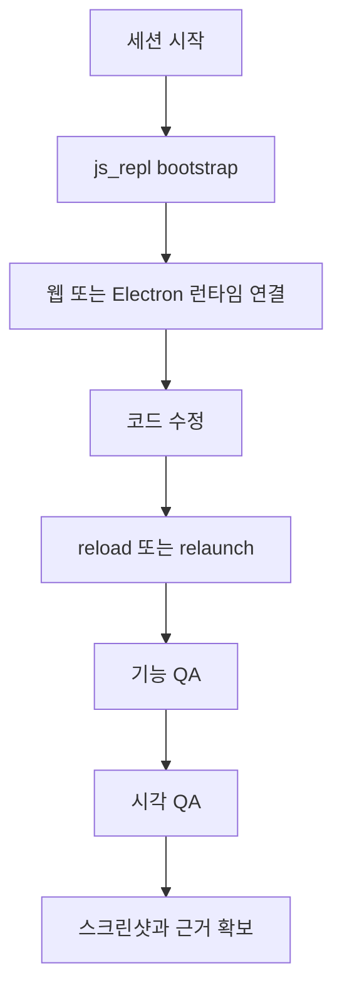

# playwright-interactive

## 한줄 요약

지속적인 `js_repl` Playwright 세션을 유지하면서 웹 또는 Electron 앱을 반복적으로 디버깅하는 상호작용형 skill이다.

## 분류

- Agent: `Codex`
- Purpose: `testing`
- Shape: `single skill`

## 언제 쓰는가

- UI를 반복적으로 수정하며 빠르게 재검증해야 할 때
- 같은 브라우저 핸들을 재사용해 디버깅 효율을 높이고 싶을 때
- Electron 앱과 웹 앱을 실제 상태로 오래 붙잡고 확인해야 할 때

## 입력과 출력

- 입력: 대상 URL 또는 Electron 엔트리, QA 체크리스트, 반복 수정 사항
- 출력: 기능 검증 로그, 시각 QA 결과, 스크린샷, 재현 가능한 디버깅 세션

## 핵심 구조

- `js_repl` 기반 장기 세션 유지
- 웹과 Electron 각각에 대한 부트스트랩 절차
- 기능 QA와 시각 QA를 분리한 체크리스트
- CSS 기준 스크린샷 정규화와 viewport 검증

## Mermaid

## 장점

- 브라우저와 핸들을 재사용해 반복 속도가 빠르다.
- 기능 QA와 시각 QA가 체계적으로 분리되어 있다.
- 웹과 Electron을 같은 방식으로 다루기 좋다.

## 한계

- `js_repl`과 Playwright 환경 준비가 필요하다.
- 상호작용형 세션이라 단발성 명령보다 운영 복잡도가 높다.

## 링크

- 원문 skill: `C:/Users/ictpt590/.codex/skills/playwright-interactive/SKILL.md`

