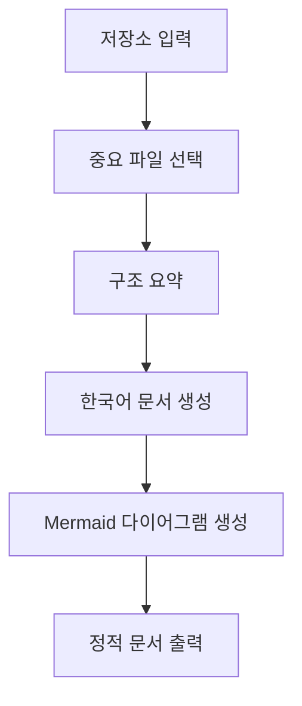

# repo-intelligence

## 한줄 요약

저장소를 읽어 한국어 digest, summary, tutorial, Mermaid 다이어그램으로 변환하는 문서화 중심 skill이다.

## 분류

- Agent: `Codex`
- Purpose: `docs`
- Shape: `single skill`

## 언제 쓰는가

- 새로운 저장소를 빠르게 파악하고 싶을 때
- 온보딩 문서를 자동 초안 형태로 만들고 싶을 때
- GitHub Pages 또는 Obsidian용 문서 묶음을 만들고 싶을 때

## 입력과 출력

- 입력: GitHub 저장소 URL 또는 로컬 디렉터리
- 출력: `digest`, `summary`, `tutorial`, `diagram` Markdown 번들

## 핵심 구조

- `SKILL.md`: 워크플로우와 출력 규칙
- `scripts/generate_repo_docs.py`: 문서 생성 파이프라인
- `references/workflow.md`: 분석 흐름
- `references/output-format.md`: 산출물 구조

## Mermaid

## 장점

- 출력 구조가 명확하다.
- 한국어 문서화에 특화되어 있다.
- 정적 사이트나 Obsidian과 잘 맞는다.

## 한계

- 저장소 구조가 복잡할수록 선택 파일 품질이 중요하다.
- AI 없이 실행하면 설명의 깊이가 제한된다.

## 링크

- 원문 skill: `C:/Users/ictpt590/.codex/skills/repo-intelligence/SKILL.md`

