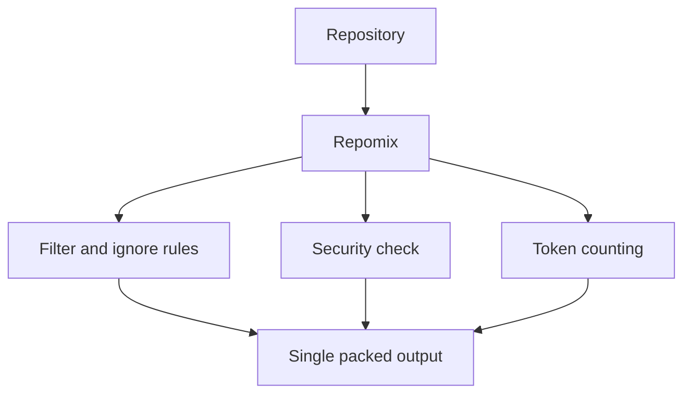

# Repomix

## 한줄 요약

저장소 전체를 AI 친화적인 단일 파일로 패킹해 LLM 입력이나 분석 파이프라인에 넘기기 쉽게 만드는 도구다.

## 분류

- Agent: `Generic`
- Purpose: `docs`
- Shape: `repository`

## 언제 참고하는가

- 저장소를 한 번에 LLM에 넣고 싶을 때
- AI 분석용 입력 파일을 안정적으로 만들고 싶을 때
- include, ignore, security check, output format 같은 ingest 옵션을 비교하고 싶을 때

## 입력과 출력

- 입력: 로컬 저장소, 특정 디렉터리, 원격 저장소 URL
- 출력: XML, Markdown, JSON, plain text 형식의 단일 패킹 파일

## 핵심 구조

- 단일 명령 기반 패킹
- `--style`로 출력 형식 선택
- `.gitignore`와 전용 ignore 규칙 반영
- security check와 token count 지원

## Mermaid

## 장점

- 입력 파일 준비를 단순화한다.
- 출력 포맷이 다양하다.
- 보안 점검과 GitHub Actions 연동이 있다.

## 한계

- 분석 자체보다는 패킹에 초점이 있다.
- 대형 저장소에서는 결과 파일이 여전히 커질 수 있다.

## 링크

- 저장소: [yamadashy/repomix](https://github.com/yamadashy/repomix)
- 근거: GitHub README 기준 단일 AI-friendly file 패킹 도구

