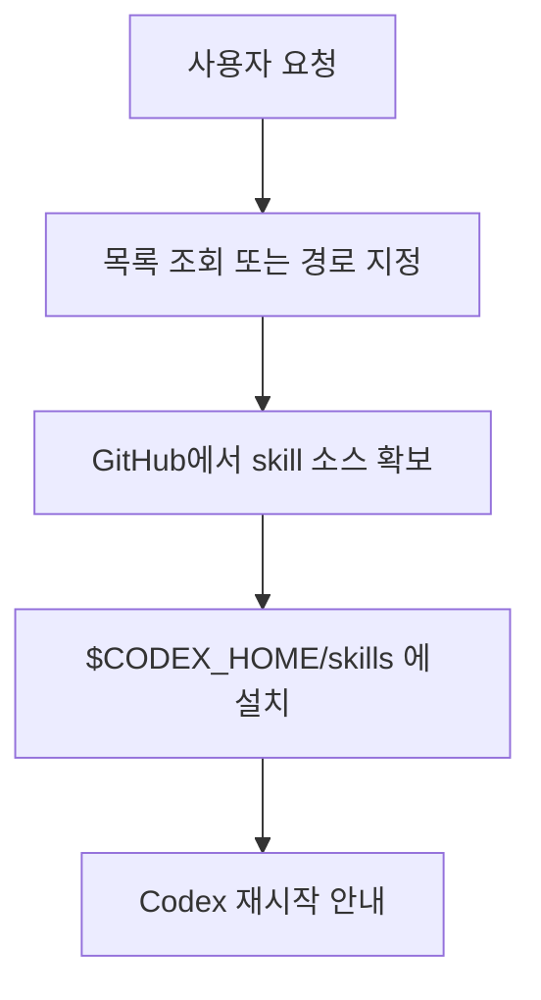

# skill-installer

## 한줄 요약

공식 curated 목록이나 특정 GitHub 경로에서 `Codex` skill을 내려받아 설치하는 skill이다.

## 분류

- Agent: `Codex`
- Purpose: `mcp`
- Shape: `single skill`

## 언제 쓰는가

- 설치 가능한 skill 목록을 보고 싶을 때
- curated skill을 빠르게 설치하고 싶을 때
- 특정 GitHub 저장소의 skill 폴더를 직접 가져오고 싶을 때

## 입력과 출력

- 입력: skill 이름 또는 GitHub 저장소/경로
- 출력: 설치 가능한 목록, 설치된 skill 디렉터리, 설치 안내

## 핵심 구조

- curated 목록 조회 스크립트
- GitHub 경로 기반 설치 스크립트
- direct download 우선, 실패 시 git fallback
- 설치 위치는 `$CODEX_HOME/skills`

## Mermaid

## 장점

- 설치 흐름이 단순하다.
- curated skill과 외부 GitHub skill 모두 다룰 수 있다.
- 공개 저장소와 일부 private 저장소 fallback 전략이 있다.

## 한계

- 네트워크와 GitHub 접근 상태에 영향을 받는다.
- 이미 설치된 skill과 충돌하면 별도 판단이 필요하다.

## 링크

- 원문 skill: `C:/Users/ictpt590/.codex/skills/.system/skill-installer/SKILL.md`
