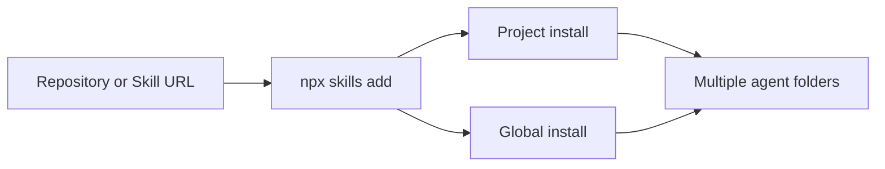

# vercel-labs/skills

## 한줄 요약

여러 agent에 skill을 설치하고 관리하는 `open agent skills` CLI 중심 저장소다.

## 분류

- Agent: `Generic`
- Purpose: `docs`
- Shape: `repository`

## 언제 참고하는가

- 여러 agent에서 공통으로 쓸 skill 설치 체계를 보고 싶을 때
- skill 배포를 `Codex` 전용이 아니라 범용 생태계 관점에서 비교하고 싶을 때
- skill 설치 UX와 업데이트 UX를 참고하고 싶을 때

## 입력과 출력

- 입력: GitHub 저장소, skill 경로, agent 선택
- 출력: 여러 agent 디렉터리에 설치된 skill 세트

## 핵심 구조

- `npx skills add` 기반 설치
- 프로젝트 설치와 글로벌 설치 분리
- symlink/copy 설치 방식
- 다수 agent 지원

## Mermaid

## 장점

- 여러 agent를 한 번에 다루는 관점이 명확하다.
- 설치와 업데이트 UX가 잘 정리되어 있다.
- 비교 사이트에서 `Codex` 단일 생태계와 대비시키기 좋다.

## 한계

- 개별 skill 내용보다 설치 툴 성격이 더 강하다.
- 각 agent별 미세한 차이는 별도 문서 해석이 필요하다.

## 링크

- 저장소: [vercel-labs/skills](https://github.com/vercel-labs/skills)
- 근거: GitHub README 기준 `The CLI for the open agent skills ecosystem`

